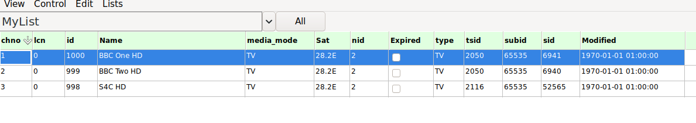
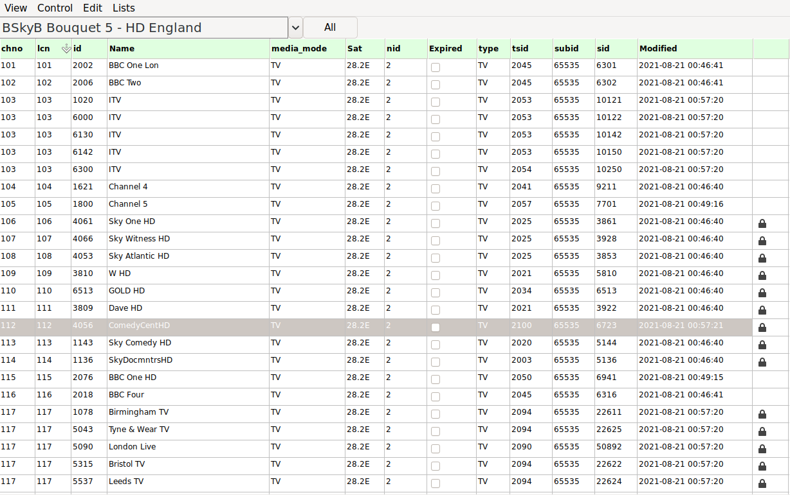

# neumoDVB #

## Channel lists and channel numbering ##

neumoDVB distinguishes between `services` and `channels`. A service is a TV or radio
service being broadcast via satellite. On the other hand, a channel is a service which has been
put in a bouquet. The difference is important: channels and services are stored as separate
records in the database. They can be assigned separate numbers for easy zapping.

Services are created when they are discovered in the SDT data or in the PAT data of muxes. Most of
their properties are updated automatically, so there is little sense in changing them. For instance,
you can change the name of a service in the service list, but this change will be overwritten with
the name in the SDT table as soon as you tune to the service, or even an other related service.

There are a few exceptions:

* the service number is purely user defined.

* some information like `VPID` (video PID) and `PMT PID` is usually not needed for tuning. In rare cases,
  their value is needed for tuning. One example is services that are not listed in the SDT, nor in PAT.
  These streams are non-compliant, rare,  and are not yet handled well by neumoDVB (please submit a ticket
  if you find
  an example)

  Another example are the encrypted BBC streams at 27.5W. In this case the PMT is encrypted and it is not
  even possible to discover the video PID prior to decrypting this PMT. Currently this decryption is implemented
  in a way that requires the user to specify the video PID.

Similarly, it is pointless to remove services from the service list because they will be recreated when neumoDVB
discovers them in SI information, even from other muxes. One exception would be to remove erroneous services
due to software bugs or no longer existing services. The latter are flagged as "expired", but not
immediately removed, to avoid deleting user specified information accidentally. In general, services are
considered "expired" if their mux still exists but the services are no longer there. Not being able to receive
a mux is not enough to expire services. After a certain amount of time (one month currently) expired
muxes are deleted.

In general there are two practical ways to prepare your channel list for viewing

* Stick to services and give them a suitable service number. Other services  will have the default
  number 0. Your services will therefore appear at the end of the list.

* Create bouquets, copy the channels you are interested into the bouquet and during viewing
  use those channel list(s) instead of the service list.

### Assigning service numbers ###

Service numbers will be used to order services in lists, when "numeric" sorting is active.

First check if some services have actually been found during scanning: `Ctrl-Shift-S` (`Lists - services`).
Select the desired service and enter edit mode by pressing `Ctrl-E`. Click on the number in the
left most column (`#`) and then type the desired number.

To store the changes, move the cursor to another service and or turn off edit mode by pressing `Ctrl-E`.

To navigate the service list, click on one of the column headers. e.g. `Name`,  to sort the list
to make it easier to find what you want. You can also restrict the list to services on a specific satellite
using the combo-popup on top. By default, it shows services from all satellites.
In the examples below we assume that "BBC One HD" has been assigned
channel number 101 and "BBC Two HD" number 102. The numbers you enter are assigned to `services`.

You can also activate a filter by right-clicking on the column header.

### Bouquets and channels ###

As an alternative, it is also possible to group services into bouquets, either bouquets defined
by the Service Information in the stream, or by defining a bouquet yourself.
To view all SI defined bouquets, use `Lists - Bouquets`. The example below shows the bouquets discovered
while scanning 28.2E. In this list you can add (`Ctrl-N`) a user defined bouquet.

User defined bouquets are called "favorite lists" to distinguish them from SI defined bouquets.
In general, it is not advised to alter data in SI defined bouquets, because your changes will be
overwritten by neumoDVB when it processes SI data. The only exception is the `channel number,`  which
will be preserved by such updates. In user defined bouquets (favorite lists), you can also change
channel names.

As explained above, bouquets consist of channels (not services). Each channel corresponds to exactly
one service (note the difference with TVHeadend), but multiple channels (in different bouquets)
can refer to the same service. A channel is stored as a separate record from the service, which is
why the channel number can differ from the service number and why services can receive different
channel orders in different bouquets/favorite lists.

### Bouquets defined in Service Information ###

Instead of creating a favorite list, you can also stick to predefined bouquets and service provider
define channel numbers. The following shows an example.

### Creating favorite lists ###
To create a favorite list, proceed as follows:

* First create a new favorite list: `Lists - Bouquets`, `Edit- New`. Only enter a new name e.g., `MyList`.

* Select the new favorite list and enter `Edit - Bouquet`. This will enter bouquet-editing mode. In this mode
the service and channel lists will highlight in red all services in the selected bouquet. At this point, there are
none yet, so obviously no services are highlighted.

* Move to the service or channel list. Select a service/channel to add to the bouquet and press
`Ctrl-M` (`Edit - bouquet add service`) to add the service to the bouquet. If a service was already
added, then `Ctrl-M` will remove it.

* When done, press `Alt-B` to exit bouquet-edit mode. You can repeat the process to create additional
favorite lists

Now check the Chanel list `List - Channels/Bouquet`. Use the combo list on top to select `MyList`,
Notice that the channel numbers are initially zero, even if you would have changed the service numbers.
The two numbers are indistinct. You can of course enter edit-mode and update `chno` as you wish.
In the example below, three channels have been assigned the numbers 1, 2 and 3

