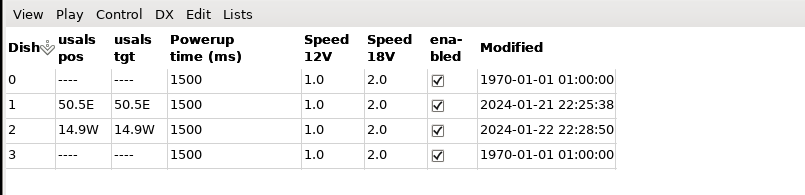

# neumoDVB #

## The dish list ##

neumoDVB can operate with multiple dishes, each of which can be equipped with a positioner. The dish list
provides information on the current dish position and on some positioner configuration parameters:

The fields heave the following meaning

* `Dish` An integer identifying the dish. This number is used in the LNB configuration for example.
  Although it cannot appear in the dish list, the special value `-1` signifies `default dish`. This
  default dish can be used for any LNB not on a positioner;
* `usals pos` The current usals position the dish is pointing at, except when it is in motion. In that case,
  it is the old position from which the move started;
* `usals tgt` The current usals position the dish is pointing at, except when it is in motion. In that case,
  it is the new position to which the positioner is moving;
* `Powerup time` The time needed by the positioner after power up before it properly executes DiSeQC commands.
  Some positioners need quite some time to initialize their firmware after power up. neumoDVB will wait
  this amount of time after power up before sending commands, This makes operating the positioner more reliable.
* `Speed 12V` The speed at which the positioner moves when powered with 12 volt. This is expressed in degree per
  second. neumoDVB uses this information to estimate when the dish will stop moving. This is important when
  acquiring spectra. It is less important when tuning, because neumoDVB can detect whether or not it points
  to the correct satellite;
* `Speed 18V` The speed at which the positioner moves when powered with 18 volt. Note that neumoDVB always
  moves the positioner at 18 volt, because this is faster;
* `Enabled` A dish can be temporarily disabled. This prevents neumoDVB from using LNBs on that dish.
