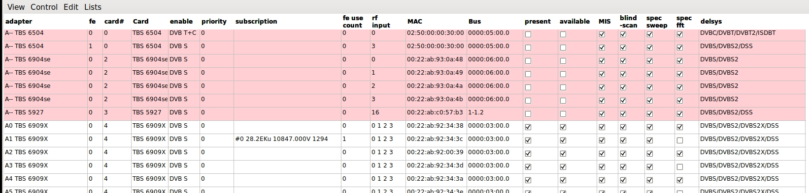

# neumoDVB #

## Configuring the frontends ##

The first test you should now perform is to check whether neumoDVB can access your DVB devices.
From the `lists` menu, choose `Frontends` (Ctrl-Shift-F). For each frontend in `/dev/dvb/adapter/...`
one entry should be listed.

Most of the columns provide information, but a few columns can be edited.
In order to edit these values, you first need to enable `Edit mode' (`Ctrl-E`).

Rows in red are for adapters that once were in the computer, but are not available for
some reason, e.g., because the card is not in the system, because the drivers are not loaded,
or because some other program is using the adapter and one of its frontends.

The columns are:

* `adapter`. Identifies a DVB adapter. The number after A is the linux adapter number, which can change
  between boots if cards are removed or added. The remaining text shows the name of the card
* `fe`. Frontend number. Some cards have multiple frontends per adapter,
  which cannot be used simultaneously. These frontends are numbered starting from 0. The list contains
  one entry per frontend (not per adapter)
* `card #`. Card number. This number is generated by neumoDVB and is used to identify the card
  in the GUI in places where there is not enough space to show the card name. The number is "stable":
  if you remove the card from the system and later insert it again, the card will still have the same
  number (unless you deleted the neumoDVB database)
* `Card`. The full name of the card.
* `Enable`. **Editable** Which DVB types you want enabled on the card. Usually you want all enabled, but
  suppose that you have a card which supports DVBT and DVBC. Usually such cards have only one connector
  shared by DVBT and DVBC. If this connector is connected to a DVBT antenna, then it cannot receive DVBC
  and you should inform neumoDVB of this by changing the default value "DVB T+C" to "DVB-T".
  This is essential if you have two such cards in the system, one connected to DVBC and another to DVBT
  as there is no way for neumoDVB to know which card is connected to which system.
* `priority`. **Editable** When neumoDVB has a choice between multiple adapters, it will choose the
  one with the highest priority. Usually the default value if fine, but if you want to deter neumoDVB
  from using a specific adapter, e.g., to keep it available for other programs, then you can set other
  adapters to a higher priority.
* `subscription`. When a frontend is in use, this column shows what it is used for. In the example, the
  card is using its first RF connector (#0) to tune 10847V on satellite 28.2E using a Ku band LNB,
  identified as LNB 1294.
* `fe use_count`. When neumoDVB needs to tuned to multiple services on the same mux, it uses the same
  frontend for all of them. This keeps adapters and resources free as much as possible for other uses.
  The number indicates how many such subscriptions are active
* `rf inputs`. High end cards such as the TBS6909X have more demodulators (e.g., 8) than tuners
  (e.g., 4).  The tuners are each connected to a specific RF input connector and can capture a
  full band (1 Ghz wide) of spectrum at once. The cards feature an internal "RF MUX" which allows connecting
  any demodulator (part of an adapter) to any tuner. This allows for very flexible use.
  For instance multiple demodulators to tune to muxes on the same LNB, as ling as they are in the
  same band and have the same polarisation.

  The field shows the available RF inputs, e.g. "0 1 2 3". These numbers correspond to the numbers
  written on the card near each connector (with some exceptions: e.g., for TBS6903X the numbers are
  0 and 3 for the first and second connector). Lower end cards do not have an RF mux. In that case
  the only available input will be "0", but there can be exceptions due to driver limitations.
* `MAC`. MAC address of the adapter. This number is supposed to be unique and allows to distinguish
  multiple cards of the same model in the system. Internally, neumoDVB uses this information to
  identify the adapter, instead of the linux DVB adapter number.

  As explained above, that adapter number can change when cards are removed from or
  added to the system. In such a case neumoDVB will not be confused because it only uses the adapter
  number for informational purposes and uses the never changing MAC address itself.

  Some cards (e.g., test specimens) do not have a proper MAC address set, or some drivers
  do not provide this information correctly. In that case neumoDVB generates a fake MAC address,
  which unfortunately cannot be guaranteed to be stable.
* `Bus`. Identifies the linux USB or PCIe bus to which the card is connected
* `present`. Shows if the adapter is currently in the system. Note that this information is
   dynamically updated.
*` available`. Shows if the adapter is currently available, i.e., not used by other programs
  or for some reason not usable. Note that this information is
   dynamically updated.
*`MIS`. Shows if the adapter supports multi-streams
*`blindscan`. Shows if the adapter and driver supports blindscan
*`spec sweep`. Shows if the adapter and driver support low resolution spectrum scan
*`spec fft`. Shows if the adapter and driver support high resolution FFT-based spectrum scan
*`delsys`. Shows the delivery systems supported by the adapter

The example shows a TBS 6909X card, which has 8 adapters,m along with some other cards which
are currently not in the system.
