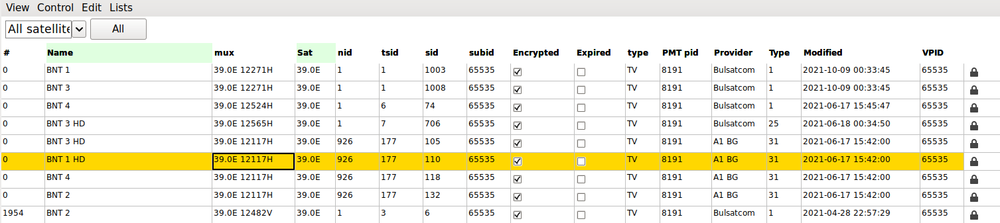

# neumoDVB #

## Filtering lists in neumoDVB ##

The NeumoDVB service. mux ... lists can grow very large. It is therefore possible to  limit the display
by filtering based on entry values. To activate a filter, press the right mouse button either on the
label of a column, or on a specific cell. This will show a popup menu. Selecting ``Filter Column'', will
bring up a filter dialog. This dialog shows a grid containing all columns taking part in the filter.
Initially this dialog will contain only a single column. The screenshot below shows the result after using
 ``Filter Column'' for the second time in the service list:

* The first time, the mouse cursor was in the `Sat` column above a cell containing ``39.0E'', and then
  the user pressed `OK' so that a filter for that was created

* The second time, the user selected a cell in the `Name` column which contained ``BNT 3.'' The user edited this
  cell in the filter dialog (by double clicking) and then changed the valuee to ``BNT.'' The screenshot below
  shows the dialog just before the user presses `OK' again.

As a result of this filtering, the service list now only shows services whose name starts with ``BNT''
on the 39.0E satellite:

The filtered columns are highlighted in green. Each of the filters can be removed/edited in two ways:

* Using the right mouse popup menu, by selecting `Remove Filter`. This will remove the column below
the mouse cursor from the filter.

* Using the right mouse popup menu, by selecting `Filter Filter Colum`. This will bring up the filter dialog,
which allows removing individual columns: select one of the cells, and then press `Remove Column' or `Remove All'.
Then press `OK`.
