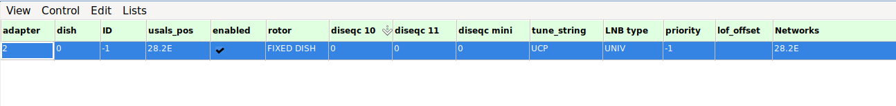
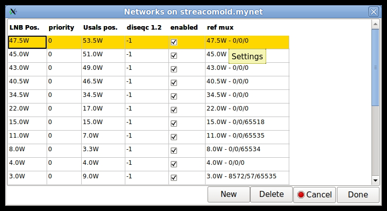

# neumoDVB #
## Configuring LNBs ##

The LNB configurations informs neumoDVB about your satellite equipment setup. neumoDVB allows for complicated
setups involving multiple LNBs on multiple dishes, various combinations of DiSEqC switches, rotors etc.
It also aims to handle some tricky cases, such as multiple satellite positions being received by the same
LNB (e.g., closely spaced satellites like 9.0E and 10.0E), LNBs in `offset-positions' on movable dishes ...

All of this can get quite complicated (with many potential bugs) and is mostly handled by setting up an *LNB*
configuration, which is a bit of a misnomer as such a configuration describes not only the LNB but also
how it is connected to your adapters.

### Simple LNB setup ###

In simple satellite setups, adding an LNB entry is easy:

First activate the LNB screen by selecting `LNBs` in the list menu. This screen will still be empty.
Selecting `New` from the `Edit` menu will add one line to the table, which you will then need to edit.

Two fields are crucial (`edit mode` needs to be on to change them):

* `adapter` should be set to the number of the adapter (the `X' in `/dev/dvb/adapterX`)
* `usals position` should be set to the location of the satellite, in one of the following formats:
"28.2E", "5.0W,"  "-5.0" or "28.2."

As soon as you exit this screen, the new LNB will be saved. Behind the scenes, also a network will be created
(see below). This network will be for the position specified by `usals position`.

If the selected adapter connects to an LNB indirectly, i.e., via one or more DiSEqC switches, you also need
to enter valid DiSEqC settings:
* `diseqc10`: the port number of the committed switch.  The first port on a switch is always named `0`, so for
diseqc10, the valid values are 0, 1, 2 and 3; -1 means "not present".
* `diseqc11`L the port number for the uncommitted switch. Valid values are  0...15. -1 means "not present".

If you use multiple "cascaded" switches, the order in which they are connected is also crucial for correct
operation:

* `tune_string`: determines the order in which DiSEqC commands are sent. The default value 'UCP' means:
first send the uncommitted command (diseqc11), then the committed command (diseqc10) and finally the command
to rotate the dish (if applicable).

Change the order to 'CUP' if your committed switch is connected directly
to the receiver. If you wish to repeat some commands, just repeat the corresponding codes. For example, 'UCUCP'
will send both switch commands twice. This is rarely needed, and neumoDVB will resend the commands anyway
if tuning fails.

### Advanced LNB setup ###

You may need to edit the following fields for more complex setups

* `dish`. If you have multiple dishes give them each a different number. This allows e.g., using
LNBs aimed at the same satellite  on multiple dishes
* `ID`. This is auto-generated. Do not edit.
* `rotor`. If you have a dish on a positioner, set this to `ROTOR_MASTER_USALS` (recommended) or
`ROTOR_MASTER_DIEQC12`. This will cause the receiver to start sending DiSEqC commands to rotate the dish.
In this case, you also need define the list of networks (satellites), that the positioner is allowed to move to
(See below).

    The value `ROTOR_SLAVE` means that the LNB is attached to a movable dish, but cannot be used
    to actually move the dish. neumoDVB will use this LNB only if it determines that the dish is already pointing
    in the right direction.

* `lnb type`. Change this in case of a C-band lnb. Currently it is not possible to change local oscillator frequencies.
* `priority`. Change this to give preference to some LNBs when multiple ones can tune to the same satellite. LNBs
  with higher values are used preferentially
* `lof_offset`. This is a read-only field. Afte rusing an LNB for a while, it will indicate any offset in the
LNBs local oscillator (the two numbers are for the low and high band, respectively)
* `Networks`. Clicking on this field will popup a window, which lists all the networks that an LNB
can tune to
* `start freq`. This sets the lowest possible frequency the LNB can tune to. The special value -1 means that this
  is set to the default value for this lnb type, e.g., 10.7 Ghz for a universal LNB.
* `end freq`. This sets the highest possible frequency the LNB can tune to. The special value -1 means that this
  is set to the default value for this lnb type, e.g., 12.75 Ghz for a universal LNB.
* `swapped pol`. If this flag is set then the voltages set on the LNB are reversed: low becomes high and vice versa.
  This is useful if your LNB is rotated, or if a dielectric plate has been inserted at a 90 degree angle.

The screenshot below shows the networks for a movable dish which is allowed to move to 6 different satellite
positions. In this table, you can add new lines (`Edit - New`) or edit existing Lines (activate `Edit mode`
if needed):

 

The fields have the following meaning:

* `LNB Pos.`: The official satellite position into this field.  This is the position as listed on satellite
websites, and -- more importantly -- as listed in the service information in the satellite muxes.

    Some satellites
    broadcast unexpected values. e.g., 51.5E may report muxes on 52.0E or 53.0E. neumoDVB considers these positions
    correct. This can be confusing, e.g., if you expect services to be present in a list for 52.0E but they are
    instead on 53.0E. neumoDVB always considers the values in the SI stream to e the true ones, as long as the
    deviation is less than 1 degree.

* `Usals pos:` The actual position you wish to move the dish to. For instance, for difficult
satellites you may get a better signal by moving to a slightly different position that the official one.
If your dish setup is imperfect, you may also need an usals position different from the true satellite location.

    Entering a "wrong" `Usals pos.` is also useful for other
    purposes. For instance, you could enter "10.0E" as the Usals. pos. for both the satellites 9.0E  and 10.0E. The
    dish will then remain at 10.0E if you tune to a service on 9.0E, reducing wear and tear if you switch
    frequently between both satellites.

    Such a "wrong" setting is also needed for `ROTOR_SLAVE` LNBs. The usals position to enter is the one for the dish,
    not the one for the slave LNB.

* `diseqc 1.2`: The diseqc command to send to move the dish, if you do not use usals. -1 means that no such command
  ill be sent. Avoid diseqc 1.2 if possible. Usals is much simpler and much more convenient.

* `ref mux`. This is a readonly field. It is set by the positioner dialog and it is the default mux, which will be
selected in that dialog.
