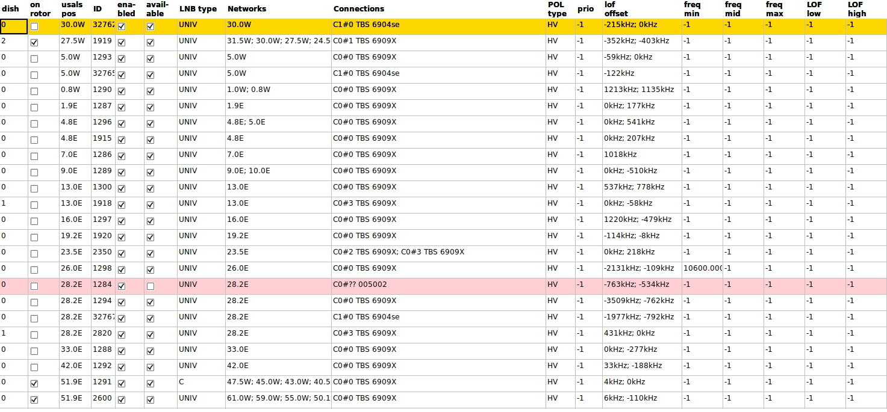
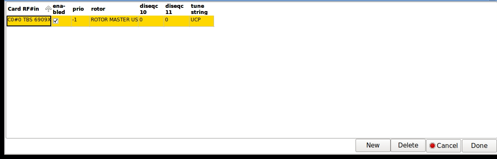

c# neumoDVB #
## Configuring LNBs ##

The LNB configurations informs neumoDVB about your satellite equipment setup. neumoDVB allows for complicated
setups involving multiple LNBs on multiple dishes, various combinations of DiSEqC switches, rotors etc.
It also aims to handle some tricky cases, such as multiple satellite positions being received by the same
LNB (e.g., closely spaced satellites like 9.0E and 10.0E), LNBs in `offset-positions' on movable dishes ...

All of this can get quite complicated (with many potential bugs) and is mostly handled by setting up an *LNB*
configuration, which is a bit of a misnomer as such a configuration describes not only the LNB but also
how it is connected to your adapters.

### LNB setup ###

Adding an LNB entry is easy:

Visit the LNB screen by selecting `LNBs` in the list menu. This screen will still be empty.
Selecting `New` from the `Edit` menu will add one line to the table, which you will then need to edit.

You need to edit only the following fields  in simple setups: `usals pos`, `networks` and `connections`.

* `dish`. **Editable** If you have multiple dishes give them each a different number. This allowsm e.g., using
  multiple LNBs aimed at the same satellite on multiple dishes. Setting this number correctly is also essential
  in case of a moveable this: neumoDVB assumes that all LNBs on the same dish will move if the dish is
  moved. If the dish numbers differ, neumoDVB will assume that the LNBs are on different dishes

* `on rotor`. **Editable** If you have a dish on a positioner, set this to true to inform neumoDVB that the dish
  is on a positioner. This field will also be set to True if any of the LNB's connections indicates that it can
  control a rotor. The opposite is however not true: it is possible to indicate that the LNB is on a rotor,
  but without allowing the user to control the dish.

* `Usals pos:` The actual position you wish to move the dish to. For instance, for difficult
  satellites you may get a better signal by moving to a slightly different position that the official one.
  If your dish setup is imperfect, you may also need an usals position different from the true satellite
  location.

  Entering a "wrong" `Usals pos.` is also useful for other purposes. For instance, you could enter "10.0E"
  as the Usals. pos. for both the satellites 9.0E  and 10.0E. The dish will then remain at 10.0E if you tune
  to a service on 9.0E, reducing wear and tear if you switch
  frequently between both satellites.

  Such a "wrong" setting is also needed for `ROTOR_SLAVE` LNBs. The usals position to enter is the one for
  the dish, not the one for the slave LNB.

* `ID`.  A unique ID to dinstinghuish LNBs.

* `enabled`. **Editable** To prevent neumoDVB from using an LNB, uncheck this box.

* `available`. **Editable** This field will be unchecked if the LNB cannot be used now, e.g., because
  the card is  not in the system, or for some other reason. If the LNB is not available, the background
  is shown in red.

* `lnb type`. **Editable** Change this in case of a C-band or Ka band lnb.

* `Networks`. **Editable** Double clicking on this field will popup a window, which lists all the
  networks that an LNB can tune to.

* `Connections`. **Editable** Double clicking on this field will popup a window, which lists all the
  connections (a connections is a specific RF input on a specific card) to the LNB.

* `pol type`. HV for a regular linear LNB, LR for a regular circular one. The other options indicate LNBs with
  swapped polarisations. E.g., a linar LNB rotated by 90 degrees or a circular one in which the depolarising
  plate is rotated by 90 degrees.

* `prio`. **Editable** Change this to give preference to some LNBs when multiple ones can tune to the same
  satellite. LNBs with higher values are used preferentially

* `lof_offset`. This is a read-only field. Afte rusing an LNB for a while, it will indicate any offset in the
LNBs local oscillator (the two numbers are for the low and high band, respectively)

* `freq min`. **Editable** This sets the lowest possible frequency the LNB can tune to. The special value
  -1 means that this is set to the default value for this lnb type, e.g., 10.7 Ghz for a universal LNB.

* `freq mid`. **Editable** This sets the frequency which separates the low from the high band on the LNB
  The special value -1 means that this is set to the default value for this lnb type, e.g., 10.7 Ghz for
  a universal LNB. For LNBs with only one band, set this value equal to `freq max`.

* `freq max`. **Editable**  This sets the highest possible frequency the LNB can tune to. The special value
  -1 means that this is set to the default value for this lnb type, e.g., 12.75 Ghz for a universal LNB.

* `LOF low`. **Editable** This sets the local oscillator frequency for the low band on the LNB. The special
  value  -1 means that this is set to the default value for this lnb type.

* `LOF high`. **Editable**  This sets the local oscillator frequency for the high band on the LNB. The
  special value  -1 means that this is set to the default value for this lnb type.

### LNB networks setup ###

The screenshot below shows the networks for a movable dish which is allowed to move to many different
satellite positions. In this table, you can add new lines (`Edit - New`) or edit existing Lines (activate
`Edit mode` if needed):

 

The fields have the following meaning:

* `LNB Pos.` The official satellite position into this field.  This is the position as listed on satellite
  websites, and -- more importantly -- as listed in the service information in the satellite muxes.

  Some satellites broadcast unexpected values. e.g., 51.5E may report muxes on 52.0E or 53.0E. neumoDVB
  considers these positions correct. This can be confusing, e.g., if you expect services to be present
  in a list for 52.0E but they are instead on 53.0E. neumoDVB always considers the values in the SI stream
  to e the true ones, as long as the deviation is less than 1 degree.

* `priority` In case multiple LNBs point to the same satellite, neumoDVB will use the one which has the '
  correct network and has the highest priority
nb
* `diseqc 1.2`: The diseqc command to send to move the dish, in case you do not use usals. -1 means that no
  such command will be sent. Avoid diseqc 1.2 if possible. Usals is much simpler and much more convenient.

* `enabled`. **Editable** To prevent neumoDVB from using a connection, uncheck this box.

* `ref mux`. This is a readonly field. It is set by the positioner dialog and it is the default mux, which
  will be selected in that dialog.

### LNB connections setup ###

The screenshot below shows the lnb connections for a movable dish which is allowed to move to many different
satellite positions. In this table, you can add new lines (`Edit - New`) or edit existing Lines (activate
`Edit mode` if needed):

 

The fields have the following meaning:

* `Card RF#in` **Editable** The card and RF input connector to which the LNB is connected. Select
  it from the available choices in the popup list. Note that the same LNB can be connected to multiple
  cards or RF inputs (e.g., a Twin or Quad LNB). In this case, more than one entry should be created.
  Use the `New` button to add an extra connection

* `enabled`. **Editable** To prevent neumoDVB from using an LNB, uncheck this box.

* `prio`. **Editable** Change this to give preference to some LNBs when multiple ones can tune to the same
  satellite. LNBs with higher values are used preferentially

* `rotor`. **Editable** If you have a dish on a positioner, and the connection is wired to the rotor
  set this to `ROTOR_MASTER_USALS` (recommended) or `ROTOR_MASTER_DIEQC12`. This will cause the
  receiver to start sending DiSEqC commands to rotate the dish.
  In this case, you also need define the list of networks (satellites), that the positioner is allowed to
  move to (See below).

  The value `ROTOR_SLAVE` means that the LNB is attached to a movable dish, but that the current
  connection is not connected to the rotor, and can therefore not be used to actually
  move the dish. neumoDVB will use this LNB only if it determines that the dish is already pointing
  in the right direction.

  The default value `FIXED DISH` should be moved for LNBs not on a movable dish

* `diseqc10`: the port number of the committed switch.  The first port on a switch is always named `0`, so for
diseqc10, the valid values are 0, 1, 2 and 3; -1 means "not present".
* `diseqc11`: the port number for the uncommitted switch. Valid values are  0...15. -1 means "not present".

If you use multiple "cascaded" switches, the order in which they are connected is also crucial for correct
operation:

* `tune_string`: determines what type of DiSEqC commands are sent, and wich order they are sent in.
`U`: uncommitted swicth; `C`: committed switch; `P`: usals command; `X`: diseqc12 command

    The default value 'UCP' means: first send the uncommitted command (diseqc11), then the committed
    command (diseqc10) and finally the command to rotate the dish (if applicable).

    Change the order to 'CUP' if your committed switch is connected directly
    to the receiver. If you wish to repeat some commands, just repeat the corresponding codes. For example, 'UCUCP'
    will send both switch commands twice. This is rarely needed, and neumoDVB will resend the commands anyway
    if tuning fails.

    If you need dieqc12 instead of usals (not recommended: usals is much easier and more versatile), then
    change this to `UCX`. Note that for diseqc12 the usals position will also be set in the GUI, but it
    will not be sent to the positioner. This 'virtual' usals value is used by neumoDVB to remember the
    current position of the dish.
