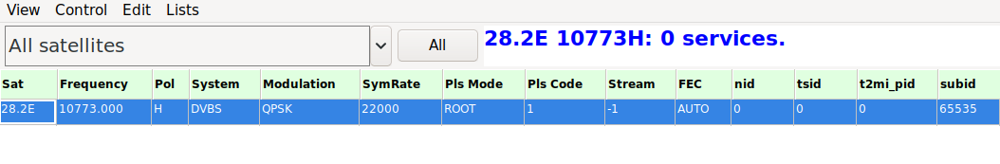
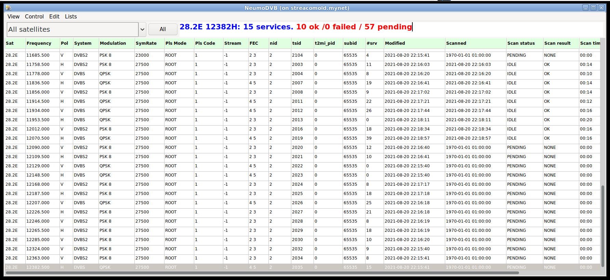
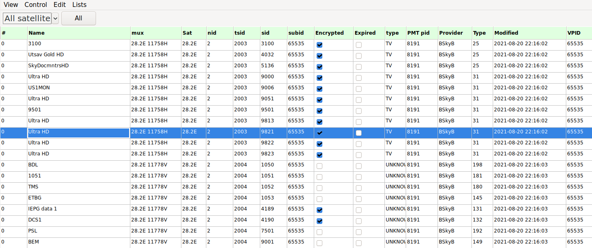

# neumoDVB #

## Scanning muxes ##

### Entering a new mux ###

neumoDVB does not (yet) come with a list of predefined muxes. Instead you will need
to define at least one mux per satellite yourself and then scan that mux. Usually
this leads to the discovery of most if not all muxes on that satellite.

Using `spectrum blindscan` most of this process can be fully automated. However in this section
we will follow a more traditional approach and just enter tuning data. Even in this case, installing
the blindscan drivers has some advantages: with these drivers, only the frequency and the polarization
need to be specified (with the exception of special muxes, such as multi-streams and T2MI streams).
Other parameters will be found by the driver.

Use `Lists - DVBS muxes` to enter the mux screen and `CTRL-N` to add a new line.
In the example below we use 10714H on 28.2E a the initial mux.

The fields to complete are:

* `Sat.` The satellite position. The popup list allows only predefined satellite positions to be selected.
You can extend or edit that list elsewhere (`Lists - satellites`).

* `Frequency:` The value is in units of Mhz, but you can add a decimal fraction for higher precision. This
can be essential to lock low bitrate transponders

* `Pol:` Polarisation

* `System:` Set to `Auto` for blindscan or `DVBS` or `DVBS2`

* `SymRate` The symbol rate is kS/s. You can enter decimal fractions for higher precision (rarely needed).
  Of blindscan is supported, there is no need to enter a value here. However, for difficult to lock muxes,
  entering a value close to the correct one will facilitate tuning. Specifically, when tuning to low bit
  rate transponders, enter a low value here.

* `PLS Mode ` and `Pls Code`: physical scrambling parameters, often needed for multi-streams. You can get
the values on the internet. If the blindscan drivers are installed, the values will be found automatically
in typical cases, but this is not always true.  The `positioner` dialog also allows searching the correct value,
but this can take hours and is not 100% reliable.

* `stream`: the stream id of a multistream. If a mux contains multiple streams, then neumoDVB considers each
  stream as a separate mux.

* `nid`: network id; leave blank because the value is not used for initial tuning.
* `tsid`: transport stream id; leave blank because the value is not used for initial tuning.
* `t2mi-pid`: The pid containing an embedded DVB-T stream on this mux; *leave blank.* A single mux can
  contain multiple such streams. neumoDVB does not directly tune to those streams, but rather to the main
  transport stream. If it discovers embedded DVB-T stream it will create additional mux entries, which will be
  distinguished by the `t2mi-pid` value. In many cases, the streams are not properly described in the SI data.
  In that case, you start by tuning with `t2mi-pid` set to 0; then you create an additional mux-entry with
  the same parameters, except for the `t2mi-pid` field. This one can be found using tsduck, dvbsnoop ... programs
  or on the web. A typical value is 4096.

Note that the newly created mux is considered a `template`. It can be used for tuning, but the "template"
status causes neumoDVB to distrust the entered data and replace it with discovered values
when tuning succeeds. At that point, the mux will transform into a real mux, and some data will be added,
such as `nid`, `tsid`.

Note that muxes have unique keys: only one mux may exist with the same `sat`, `nid`, `tsid` and `t2mipid`
values. Note that `stream_id` is not in this list. There are technical reasons for this: usually different
multi-streams adopt different ts_id values and the`stream_id` value is therefore not needed to uniquely
identify them. T2MI is more of mystery in this respect. mux keys are alos used to identify services, and
we opted to not include redundant information in them. `stream_id` is currently considered redundant, but
`tmipid` not. This could change in future.

### Scanning a mux ###

Now, the newly created mux can be scanned using the command `Control - Scan` (`Ctrl-S`). Make sure the mux
is selected (appears blue) before you select the command from the menu. neumDVB will scan the mux, discover other
muxes on this satellite and then add those to the scan queue. All discovered muxes will be scanned for
services as soon as a frontend becomes available (because it has stopped scanning a mux).

The muxes screen will start filling up as in the screenshot:

While this is going on, you can also check the services screen `Lists - Services`.
It will look like:

This way of scanning is very thorough, and therefore takes a while. It will go faster if you have defined
multiple LNBs which can all tune to the same satellite. In this case, the scan work will be distributed
over all tuners. Even with this thorough scan, it is still possible that some muxes are not discovered.
This happens when satellites contain multiple unrelated networks. In this case, you add one of the mussing
muxes, which will probably again cause many others to be found.

A faster way of scanning is to "tune" the mux using `Control Tune` (`Ctrl-ENTER`). This will discover
fewer services and fewer muxes because it will only tune the selected mux and not any of the newly
discovered ones. If the mux broadcasts standard compliant SDT and NIT tables, it is not really necessary
to scan the other discovered muxes to find their services. However, services on not yet discovered muxes
will be missing.
