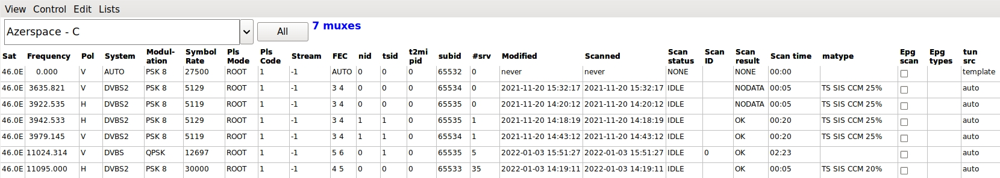
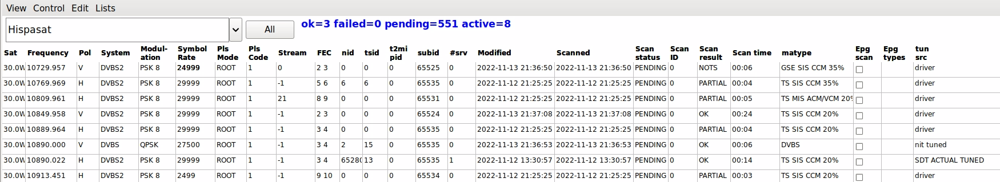
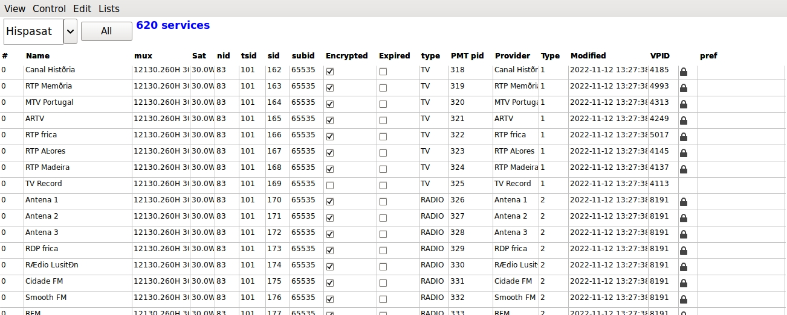

# neumoDVB #

## Scanning muxes ##

### Entering a new mux ###

neumoDVB does not (yet) come with a list of predefined muxes. Instead you will need
to define at least one mux per satellite yourself and then scan that mux. Usually
this leads to the discovery of most if not all muxes on that satellite.

Using `spectrum blindscan` most of this process can be fully automated. However in this section
we will follow a more traditional approach and just enter tuning data. Even in this case, installing
the blindscan drivers has some advantages: with these drivers, only the frequency and the polarization
need to be specified (with the exception of special muxes, such as multi-streams and T2MI streams).
Other parameters will be found by the driver.

Use `Lists - DVBS muxes` to enter the mux screen and `CTRL-N` to add a new line.

The fields to complete are:

* `Sat.` **Editable** The satellite position. The popup list allows only predefined satellite positions
  to be selected.
  You can extend or edit that list elsewhere (`Lists - satellites`).
* `Frequency.` **Editable**  The value is in units of Mhz, but you can add a decimal fraction for higher
  precision. This can be essential to lock low bitrate transponders
* `Pol.` **Editable** Polarisation
* `System.` **Editable** Set to `Auto` for blindscan or `DVBS` or `DVBS2`
* `Symbol Rate.` **Editable**  The symbol rate is kS/s. You can enter decimal fractions for higher precision
  (rarely needed). If blindscan is supported, there is no need to enter a value here. However, for difficult
  to lock muxes, entering a value close to the correct one will facilitate tuning. Specifically, when tuning
  to low bit rate transponders, enter a low value here.
* `PLS Mode ` and `Pls Code.` **Editable** physical scrambling parameters, often needed for multi-streams.
  You can get the values on the internet. If the blindscan drivers are installed, the values will be found
  automatically in typical cases, but this is not always true. The `positioner` dialog also allows searching
  the correct value, but this can take hours and is not 100% reliable.
* `FEC`: **Editable** Forward Error Correction. Almost never needs to be set.
* `stream.` **Editable**  the stream id of a multi-stream. If a mux contains multiple streams, then neumoDVB
  considers each stream as a separate mux.
* `t2mi-pid`: **Editable** The pid containing an embedded DVB-T stream on this mux; *leave blank.* A single
  mux can contain multiple such streams. neumoDVB does not directly tune to those streams, but rather to the
  main transport stream. If it discovers embedded DVB-T stream it will create additional mux entries, which
  will be distinguished by the `t2mi-pid` value. In many cases, the streams are not properly described in
  the SI data. In that case, you start by tuning with `t2mi-pid` set to 0; then you create an additional
  mux-entry with the same parameters, except for the `t2mi-pid` field. This one can be found using tsduck,
  dvbsnoop ... programs or on the web. A typical value is 4096.
* `mux id`: value to help uniquely idenity a mux: only one mux can exist on the same sat, with the same mux id,
  stream id and t2mi pid
* `nid`: **Editable**  network id; leave blank because the value is not used for initial tuning.
* `tsid`: **Editable**  transport stream id; leave blank because the value is not used for initial tuning.

Note that the newly created mux is considered a `template`. It can be used for tuning, but the "template"
status causes neumoDVB to distrust the entered data and replace it with discovered values when tuning
succeeds. At that point, the mux will transform into a real mux, and some data will be updated
such as `nid`, `tsid`. Only after a mux has been tuned successfully (at least locked) it data will be saved
in the database.

Note that muxes have unique keys: only one mux may exist with the same `sat`, `stream`, `t2mi pid` and `mux id`
values. Muxes wit the same frequency and polarisation can exist on the same sat if tey differ in
`stream` or `t2mi pid`. Such muxes have the same `mux id` to show that they are related (transitted by the same
transponder). Muxes with overlapping bandwidth (as determined from frequency and symbol rate) should not exist
in the database, but can occur accidentally, e.g., as broadcasters change frequency plans

### Scanning a mux ###

Scanning a mux in this context really means: adding the mux to the scan queue. NeumoDVB
then tunes the mux when the needed resources are available, discovers the services on it, and also other muxes
on other frequencies as reported in the broadcast NIT tables. For the moment, neumoDVB only trusts data for
the sateliite containing the mux being scanned, and will discard reported muxes on other satellites as often
this data is in error. If new muxes are discovered, they are also added to the scan queue, thus allowing
a full satellite scan even when blindscan is not available. When blindscan is available, the saved information
also makes it easier to lock difficult muxes and by comparing the saved information with information reported
by the driver, neumoDVB can also detect and correct frequency offsets created by imperfect LNBs.

At any time, the user can add more muxes to the scan queue, even while scanning is going on.
At the start of scanning and whenever a mux scan ends, NeumoDVB checks the scan queue and tries to
tune as many muxes in the queue as possible using all available adapters. If you have multiple dishes
capable of tuning the same satellite, or if your DVB card supports Slave tuners, then multiple muxes
will be scanned in parallel.

**Be careful if you have have a dish on a positioner:**
In the current code, the scan process will avoid moving any satellite dish (later this could be an
option). Therefore you first have to move the dish to the proper position, e.g., by tuning to a service
or mux on it.

After adding a mux in the mux list, the newly created mux can be added to the scan queue using the command
`Control - Scan` (`Ctrl-S`). Make sure the mux is selected (appears yellow) before you select the command
from the menu. It is also possible to scan many muxes simultaneously by selecting them all before
`Control - Scan`. Remember that the scan itself can also add muxes to the scan queue and that you can add
muxes at any stage, even on other satellites. Those muxes will be scanned as soon as possible.

The muxes screen will start filling up as in the screenshot:

Some fields in the table, which were not yet discussed are populated during scanning. Some, but not all
of these fields are also updated when tuning a mux or a service on a mux:

* `Modified`. The last time the database record for this mux was updated.
* `Scanned`. The last time the mux was scanned, as opposed to merely tuned.
* `Scan status`. This shows the current progress of scanning:  `PENDING`: the mux is scheduled for scanning;
  `ACTIVE`: the mux is currently being scanned; `NONE`: the mux has never been scanned;
  `IDLE`: the mux has already been scanned in the past and is not scheduled for scanning,
* `Scan ID`. In case multiple independent scans are in progress (e.g., multiple neumoDVB programs are running
   simultaneously), the number identifies the scan the mux belongs to. A mux can only be scanned by one nuemoDVB
   program at a time. This is used for internal purposes and debugging.
* `Scan result`. The result of the last scan:
   * `NONE`: the mux has never been scanned;  `NOLOCK`: the mux could not be
     locked (carrier and timing lock); `ABORTED`: the scan was aborted before a result was available;
   * `PARTIAL`: the scan was aborted but some partial data was retrieved;
   * `OK`: the scan succeeded fully;
   * `NOATA`: everything was working, the mux is s transport stream but no useful SI data was discovered on the mux;
   * `NOTS`: everything was working, but this mux is not a transport stream and was not analyzed;
   * `BAD`: the mux could not be tuned because some parameter (frequency, symbol rate) was rejected by the driver;
   * `TEMPFAIL`: the mux could not be tuned because the driver reported that some resource was not available. This
   can happen on some cards, e.g., 6909X, when too many tuners are in use simultaneously. The user may retry
   the scan later and it may then succeed; `DISABLED`: the user has disabled scanning on this mux.
* `Scan lock`. The detailed locking status as reported by the driver:
   * `NONE`: the mux has never been scanned;
   * `NOLOCK`: the mux could not lock in any meaningful way;
   * `TMG`: timing lock, i.e., locking to the symbol rate clock was achieved;
   * `CAR`: in addition to timing lock, carrier lock was achieved
   * `FEC`: in addition to carrier lock, the forward error corrector or viterbi decoder locked to the data stream;
   * `SYNC`: in addition to FEC lock, the driver locked on to the transport stream sync bytes, implying that DVB
     packets are correctly decode. This applies only to transport streams.
* `Scan time`. Total time taken by the scan. Typical values will be between 10 and 50 seconds depending on the
   repetition rate of the SI data tables in the stream.
* `matype`. The matype value found in the physical layer of the stream. This indicates if the stream is a transport
   stream (TS) or some other type of generic stream (GCS, GSE); if it is a single stream (SIS) or a multi stream (MIS)
   and if it uses constant modulation (CCM) or variable modulation (ACM/VCM).
* `Epg scan`. Currently not used
* `Epg types`. Some muxes carry proprietary EPG data, e.g., freesat. If such data is discovered, and if neumoDVB
  knows how to interpret it, it will be  indicated here. Currently supported:
  * `FREESAT`: low-rate freesat data;
  * `FSTHOME`: high data rate freesat home mux;
  * `SKYUK`: Sky UK data;
  * `SKYIT`: Sky Italy data;
  * `MOVISTAR`: Movistar Spain data;
  * `VIASAT`: Viasat Nordic data.
* `tun src`. The source of the reported tuning parameters such as frequency, symbolrate and modulation parameters.
  In general neumoDVB trusts what the driver reports, rather than what is reported in the NIT tables in the stream,
  but frequency and symbol rate are in some cases taken from the SI stream to avoid minor rounding errors. This is
  a complex process because some muxes report wrong frequencies (even on 28.2E). The possible values are:
  * `tmpl`: Frequency and such were selected by the user (typing, clicking a mux on the spectrum screen...)
     and this mux is not in the database. The value is used internally, but will never appear in lists;
  *  `nit`: Tuning parameters were found in the NIT ACTUAL table while the mux was actually tuned, allowing
     neumoDVB to verify the value and only use it if it is reasonable;
  *  `nita`: Tuning parameters were found in the NIT ACTUAL table while some other mux was actually tuned. This specific
     mux has not yet been tuned and neumoDVB was not able to verify tuning parameters;
  *  `nito`: Tuning parameters were found in the NIT OTHER table while some other mux was actually tuned This specific
     mux has not yet been tuned and neumoDVB was not able to verify tuning parameters;
  *  `driver`: Tuning parameters are the ones reported by the driver. No NIT ACTUAL data has been found (yet) in the
     current mux. The reported frequency has been corrected taken into account LNB locaal oscillator offset, and will
  *  `user`: Currently not used. Tuning parameters have been specified by the user to override some auto detected
      values. neumoDVB is not allowed to change the mux parameters;
  *  `auto`: Currently not used. The user has indicated that neumoDVB may start changing tuning parameters (after
     locking them earlier by specifying the `user` setting), but has not yet tuned the mux and therefore not changed
     any tuning parameters yet.
  *  `unknown`: Some kind of error has occurred.
* `ids src`. The source of the reported `nit id` (original network id) and `ts id` (transport stream id). These IDs
  are used in DVB to connect services to muxes and epg data to services. They must be unique according to DVB standards,
  but many broadcasters do not care about standards leading to inconsistent values or duplicate values.
  *  `tmpl`: Values undefined;
  *  `sdt`: Values as reported by SDT in the mux; these values are considered the most reliable and
      will never be overwritten by values from other sources
  *  `nit`: Values as reported by NIT ACTUAL in the mux; SDT ACTUAL has not yet been seen in the mux and
     in that case we use the values in the NIT table instead. For standard compliant muxes this is only
     a temporary state;
  *  `pat`: `ts is` is as reported in the PAT table in the mux; NIT ACTUAL and SDT ACTUAL have not yet been
     seen in the mux. For standard compliant muxes this is only
     a temporary state;
  *  `nita`: Values as reported by NIT ACTUAL in some other mux; neumoDVB has not yet processed the SDT and NIT
     tables on the mux;
  *  `nito`: Values as reported by NIT OTHER; neumoDVB has not yet processed the SDT and NIT
     tables on the mux;
  *  `sdto`: Values as reported by SDT OTHER table in some other mux; neumoDVB has not yet processed the SDT and NIT
     tables on the current mux;
  *  `user`: Values as entered by the user and not to be overridden by neumoDVB;
  *  `auto`: Values as entered by the user, but neumoDVB is allowed to override them.

While Scanning is going on, you can also check the services screen `Lists - Services`.
It will look like:

This way of scanning is very thorough, and therefore takes a while. It will go faster if you have defined
multiple LNBs which can all tune to the same satellite. In this case, the scan work will be distributed
over all tuners and LNBs. Even with this thorough scan, it is still possible that some muxes are not discovered.
This happens when satellites contain multiple unrelated networks. In this case, you add one of the missing
muxes, which will probably again cause many others to be found.

A faster way of scanning is to "tune" the mux using `Control Tune` (`Ctrl-Enter`). This will discover
fewer services and fewer muxes because it will only tune the selected mux and not any of the newly
discovered ones. If the mux broadcasts standard compliant SDT and NIT tables, it is not really necessary
to scan the other discovered muxes to find their services. However, services on not yet discovered muxes
will be missing.
