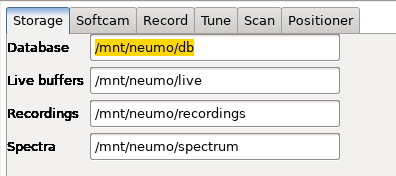
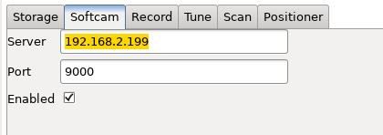
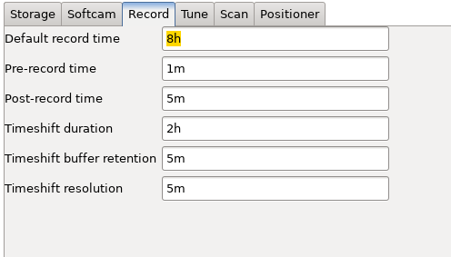
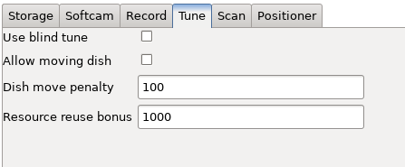
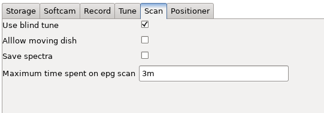
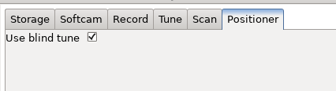

# neumoDVB #

## neumoDVB options ##

Several aspects of neumoDVB can be configured. Most options are stored in the neumoDVB
`devdb.mdb` database, but file paths, e.g., where neumoDVB stores its databases
are instead stored in neumoDVB's configuration file, which i `~/.config/neumodvb/neumodvb.cfg`.

Most options can be edited using the `options dialog,` which can be found in the
edit menu (only active when selecting one of the lists, e.g., the `services` list).

Usually there is no need to edit these options to get started with neumoDVB.

The screenshots below show various defaults that can be set.

It may be a good idea to store recordings and live buffers
in some specific file system, e.g., to avoi dthat these large files are included in backups
of your home directory.

* Database: the location where neumoDVB stores its database
* Live buffers: the location where neumoDVB stores its live buffers. These files can be very large
* Recordings: the location where neumoDVB stores its recordings. These files can be very large and there
  can be many of them
* Spectra: the location where neumoDVB stores its spectra.

Although the defaults will work, it may be a good idea to store recordings and live buffers
in some specific file system, e.g., to avoid that these large files are included in backups
of your home directory.

Note that changing any of these paths does **not move** existing files.

neumoDVB can connect to an oscam server, e.g., serving an official smart card in a card reader
on your computer. Only `oscam` is supported.

* Server: the IP address or the hostname of the server
* Port: the port the server
* Enabled: turn this off to disable decryption (currently not supported).

Various durations related to recordings can be set here. Use a suffix `m` for minutes, `h` for hours
and `s` for seconds. You may need to restart oscam before new values become active.

* Default record time: in case your ecord a program without epg, this is the default recording time,
  which will be shown in the dialog window, and can be edited there.
* Pre-record time: the time to start the recording early before its official EPG start time.
* Post-record time: the time to end the recording later after its official EPG end time.
* Timeshift duration: the maximum amount of timeshift data to preserve while a service is live.
* Timeshift buffer retention: how long to preserve a timeshift buffer after unsubscribing a service.
  If you re-subscribe the service during this time, then the old timeshift data can still be viewed.
* Timehsift resolution: timeshift buffers are split into buffers of this length, except when recording.
  This allows easy deletion of old data.

* Use blind tune: if enabled, always use blind tune when tuning a service (usually not needed)
* Allow moving dish: if enabled, when tuning a service, allow moving the dish automatically. If disabled,
  neumoDVB will ignore satellites not pointed to by your dish
* Dish move penalty: if automatic dish motion is enabled, neumoDVB still prefers tuning a service on an
  LNB on a dish that does not need to be moved. The value determines ho much neumDVB should hate moving a dish;.
* Resource reuse bonus: neumoDVB likes reusing resources. E.g., when tuning two services on the same mux,
  it will prefer using the same adapter. The value indicates how high this preference is.

* Use blind tune: if enabled, always use blind tune during scanning (usually not needed)
* Allow moving dish: if enabled, during scanning, allow moving the dish automatically. If disabled,
  neumoDVB will ignore satellites not pointed to by your dish
* Save spectra: when scanning satellite bands, spectra are acquired. The option determines if these
  will be saved to dish. Note that spectra are always saved when the user deliberately acquires a spectrum
  using the spectrum dialog.
* Maximum time spent on EPG scan: some muxes transmit EPG data over a very long period of time. neumoDVB
  will stop looking for EPG data even if the scan is not complete, after this amount of time.

* Use blind tune: if enabled, set the `blind tune` button to on by default in the positioner
  and spectrum dialog.
