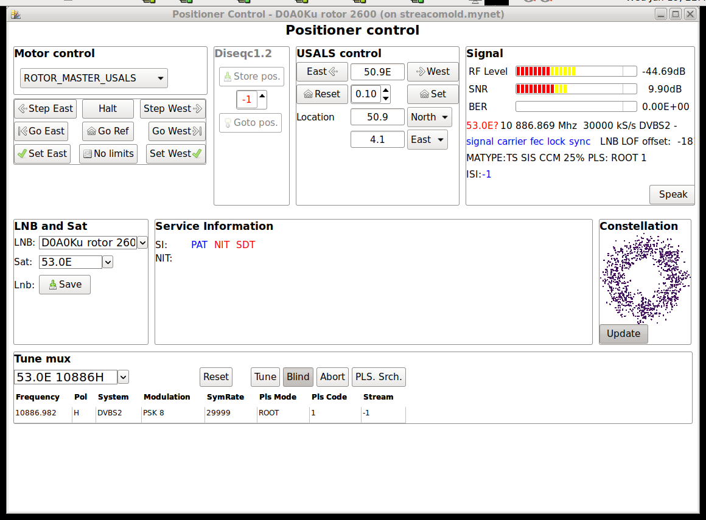

# neumoDVB #

## Positioner control ##

neumo DVB can operator DiSEqC positioners, also called "rotors". DiSEqC positioners are controlled
using one of two protocols:

* USALS or DiSeqC 1.3 is the easiest to use: the receiver tells the motor how many degrees to rotate.
  This rotation angle is *not* the orbital position but is computed from it. This requires knowledge of
  where your dish is located (latitude and longitude)
* DiSeQc 1.2 is more complicated: the user first manually positions the rotor (by pressing buttons on the
  receiver) until good reception is achieved, Then the user presses another button on the receiver to
  store this position under a user-selected preset number. Future tunes will then ask the positioner
  to go to the correct preset.

Before using an USALS positioner, it is essential that you enter the latitude and longitude in
neumoDVBs config file, usually `~/.config/neumodvb/neumodvb.cfg`. These numbers will be shown
on the positioner panel, but changes made in `USALS Location` on the panel are not yet saved automatically
in this file. This may change in a future version.

The positioner control panel is shown in the screenshot below. The bottom part contains information and
controls which also appear on the spectrum screen. They operate in the same way and will not discussed them here.
Despite its name, the Positioner Control panel is also useful for LNBs on fixed dishes. In this case,
the top panels are not useful. but the bottom panels allow you to easily tune to muxes, verify signal levels

The top panel, from left to right, has the following sub-panels:

* `Motor control`allows switching between USALS, DiSeQc1.2 positioners, slave LNBs (which are LNBs on a
  moving dish, but without the possibility to send commands to the positioner)  and a setup without a positioner.
  The documentation for the LNB screen provides related information.

 * The buttons below allow manual rotor control.  `Step East`  and `Step West` move the dish by the smallest possible
   amounts.  `Go East` and `Go West` will drive the dish continuously. Motion will stop when you press `Halt`,
   when your dish reaches internal limits, or until it hits a wall or some other obstacle.
   Use at your own risk.  `Go Ref` goes to the reference position. If your dish is properly installed,
   it will move due south.

   To avoid damage, it is possible to set software limits on the range in which the dish can move. To use this
   feature, first move the dish using any of the positioner commands to the west-most position you consider
   safe. Then press `Set West`. From this point on, the dish will refuse to move more west that this. The
   `Set East` button operates similarly. If the set limits are too narrow, your can remove them by pressing
   the `No limits` button and then set new ones.

 * `Diseqc 1.2` allows you to store dish positions at a specific numbered slot. First,  move the dish using
   any of the positioner commands until you receive the satellite you want. You can observe SNR levels to make
   the best possible decision and use `Step East` and `Step West` to fine tune.
   Once you are satisfied with the current position, enter a preset number in the text field
   on the DiSEqC1.2 panel and press `Store pos.` to associate the current dish position with the preset.
   Obviously, it is important to select a different preset number for different satellite positions.
   The `Goto pos.` button allows you to move the dish manually to a specific preset position.

   *Very important*. After making changes, these changes are not automatically saved. You need to press the
   `Save` button on the `LNB and sat` panel to save the preset position into the database. In case you forget,
   neumoDVB will remind you when you try to close the positioner control.

 * `USALS control` allows you to send the positioner manually to a specific satellite position,
   by entering it in text form in various formats: 5.0W, -5.0, ... The `East` and `West buttons` ask for
   a small step in the specified direction, but in this case the step is in known units (e.g., 0.1 degree)
   which means neumoDVB knwows the position the dish moves to and shows it on screen.
   The size of the step can be changed using the `step` spin control. which is initially set at 0.1 degree.
   `Set` activates the textual value entered (but you can also press the `ENTER` key).
   `Reset` changes the current USALS position to the one specified in the network

   *Very important*. After making changes, these changes are not automatically saved. You need to press the
   `Save` button on the `LNB and sat` panel to save the preset position into the database. In case you forget,
   neumoDVB will remind you when you try to close the positioner control.

   `Location` allows you to enter your dish's location. Changes to the values will be taken into
   account the next time any USALS operation is performed. Unfortunately changes are not yet written
   to neumoDVB's config file, so you will need to edit that file to make permanent changes.

 * `LNB and Sat` allows you to select the desired LNB and the network (sat) on this LNB. The `Save` button
   saves all kinds of lnb related changes, including usals settings, default mux ...
   The `Reset LOF` button resets the local oscillator offset of the LNB to zero. The latter is automatically
   updated by comparing information from the driver with service information from the mux

 * `Tune Mux` allows you to select a mux from the list of known muxes, and then adjusting the main tuning parameters
   as needed. If the `Blind` button is gray, nlindscan will be performed. The `Tune` button starts tuning.
   The `ABort button` ends tuning. `PLS srch.` is an experimental feature to cycle through all possile PLS codes
   until the mux locks (this can take several hours)
