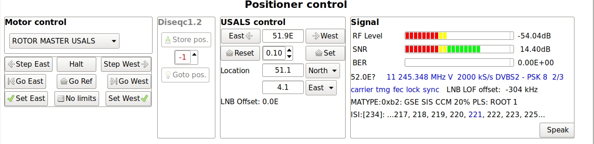
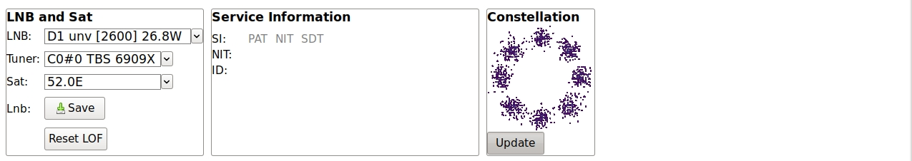
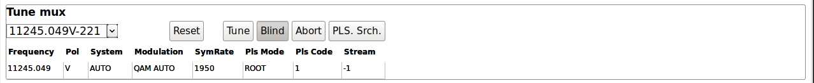
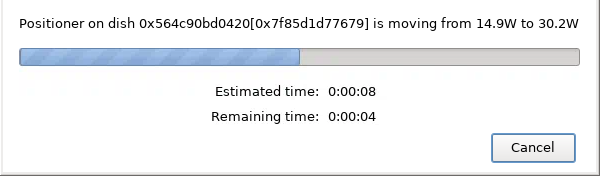

# neumoDVB #

## Positioner control ##

As its name suggests, the `positioner control screen`  can operator DiSEqC positioners, also called "rotors".
However, this window is also useful on fixed dishes as it allows blind tuning to muxes, checking signal
levels, tuning parameters and IQ constellations.

DiSEqC positioners are controlled using one of two protocols:

* USALS or DiSEqC 1.3 is the easiest to use: the receiver tells the motor how many degrees to rotate.
  This rotation angle is *not* the orbital position but is computed from it. This requires knowledge of
  where your dish is located (latitude and longitude). Once this longitude and latitude information is
  set correctly, neumoDVB will compute everything else automatically
* DiSEqC 1.2 is more complicated: the user first manually positions the rotor (by pressing `Step East`
  and `Step West` buttons on the) until good reception is achieved, Then the user presses the `Store pos.`
  button  to store this position under a user-selected preset number. Future tunes will then ask the positioner
  to go to the correct preset.

Before using an USALS positioner, it is essential that you enter the latitude and longitude in
neumoDVB's positioner dialog next to `Location` on the `USALS Control` panel.

The positioner control panel is composed of many panels organized in rows. Below, a screenshot of it
has been split in 3 parts, which are discussed separately.

The top panel, from left to right, has the following sub-panels:

* `Motor control` allows switching between USALS, DiSEqC1.2 positioners, slave LNBs (which are LNBs on a
  moving dish, but without the possibility to send commands to the positioner)  and a setup without a
  positioner. The documentation for the LNB screen provides related information.

  The buttons on that panel also allow manual rotor control, but of course only if an USALS or DiSEqC1.2
  positioner is selected. `Step East`  and `Step West` move the dish by the smallest
  possible amount.  `Go East` and `Go West` will drive the dish continuously until it hits its configured limits;
  Motion will stop when you press `Halt`, when your dish reaches internal limits, or until it hits a wall or some other obstacle.
  Use at your own risk.  `Go Ref` goes to the reference position (due south if your dish is properly set up).

  To avoid damage, it is possible to set software limits on the range in which the dish can move. To use this
  feature, first move the dish using any of the positioner commands to the west-most position you consider
  safe. Then press `Set West`. From this point on, the dish will refuse to move more west that this. The
  `Set East` button operates similarly. If the set limits are too narrow, your can remove them by pressing
  the `No limits` button and then set new ones.

  If you are feeling adventurous, press the `No limits` button, which will exactly what it promises to do.

* `DiSEqC 1.2` allows you to store dish positions at a specific numbered slot. First,  move the dish using
   any of the positioner commands until you receive the satellite you want. You can observe SNR levels to make
   the best possible decision and use `Step East` and `Step West` to fine tune.
   Once you are satisfied with the current position, enter a preset number in the text field
   on the DiSEqC1.2 panel and press `Store pos.` to associate the current dish position with the preset.
   Obviously, it is important to select a different preset number for each satellite position.
   The `Goto pos.` button allows you to move the dish manually to a specific preset position.

   *Very important*. After making changes, these changes are not automatically saved. You need to press the
   `Save` button on the `LNB and sat` panel to save the preset position into the database. In case you forget,
   neumoDVB will remind you when you try to close the positioner control.

   DiSEqC 1.2 is not as well tested as USALS. If possible, use USALS.

* `USALS control` allows you to send the positioner manually to a specific satellite position,
   by entering it in text form in various formats: 5.0W, -5.0, ...  This number is always the satellite
   position of the central LNB on your dish, even if you have selected an offset (sidecar) LNB.

   The `East` and `West buttons` ask for a small step in the specified direction, but in this case the step
   is in known units (e.g., 0.1 degree) and will also affect the USALS position. The adjustment is also sent
   using USALS instead of `step` DiSEqC commands.

   The size of the step can be changed using the `step` spin control. which is initially set at 0.1 degree.
   A bigger step may be useful for smaller dishes. `Set` activates the textual value entered (but you can also press the `ENTER` key).
   `Reset` changes the current USALS position corresponding to the satellite selected in the `LNB and Sat` panel.
   Note that for an offset LNB the new USALS position will differ from the satellite position, as the USALS position
   is the position of the dish, i.e., of its central LNB.

   *Very important*. After making changes, these changes are not automatically saved. You need to press the
   `Save` button on the `LNB and sat` panel to save the preset position into the database. In case you forget,
   neumoDVB will remind you when you try to close the positioner control.

   `Location` allows you to enter your dish's location. Changes to the values will be taken into
   account the next time any USALS operation is performed. These changes are written to the database
   as soon as they are changed, and therefore remembered.

   `LNB Offset` is usually 0, but will become non-zero when you use an offset LNB. The first configuration
   of such an LNB proceeds as follows: first create the a first network (on the `LNB` list screen) entering
   the satellite position to receive. At this stage, the USALS position of the network will be set to the
   satellite position to receive, which is incorrect as neumoDVB does not know the correct USALS position
   to use, as that depends on where your LNB is on the dish.

   To correct this problem, tune to a mux on the desired satellite on the positioner screen and
   there adjust the USALS position until you have an optimal signal. Now press the `Save button` on the
   `LNB and Sat` panel. From this point on, neumoDVB can estimate the additional rotation needed to point
   the offset LNB not just for this satellite, but for any satellite.

   Then start adding additional networks on the `LNB list` screen. If needed you can tweak their USALS position
   on the positioner screen to improve reception, but on a perfectly aligned dish that is not needed.

*  The `Signal` panel shows information about the received signal. The various lines are explained below:

   * The first three lines show signal strength, SNR and Bit Error Rate (BER) before "forward error correction". The latter is
     an indicator of signal quality. A non-zero BER does not necessarily mean that reception will be impaired.

   * Below the signal indicators, neumoDVB shows the current satellite position and the tuning information reported
     by the driver. In the screen shot a question mark appears behind the "52.0E" because the tuned mux has no DVB SI
     tables. Regular DVB muxes will have a valid NIT table which in most cases will include a satellite position information.
     If that information agrees with the LNB setting, then neumoDVB will remove the question mark.

     This is a very useful feature when setting up your dish as it reports the correct satellite. Note that some satellites
     have very few regular DVB muxes and/or have no or invalid satellite information. In most cases neumoDVB will detect
     such problems and therefore add a question mark.

   * The next line indicates the state of the various `lock bits` of the driver. In the screenshot they all appear
     in blue, meaning that everything is locked properly. Red colours indicate that lock has not been achieved.
     Although various drivers for various cards interpret the lock bits sometimes differently, the meaning is:
       * `carrier`: the driver has locked onto a frequency
       * `tnmg`: the timing loop has locked, i.e., the driver has synchronized to the symbol rate
       * `fec`: forward data correction is working properly
       * `lock`: a summary of the preceding bits: demodulation is working as expected
       * `sync`: The driver has detected DVB sync words in the stream. This lock bit does not always have to be on
       to receive valid data, but it should be on for all broadcast muxes to properly decode the stream.

     On the right of the lock bits, the `LNB lof offset` field shows the estimated difference between the real
     "local oscillator frequency" of the LNB and its correct value. Standard consumer LNBs can have errors of up to 2MHz,
     which complicates tuning: muxes will appear at the wrong frequency and especially tuning narrow band signals may
     fail because of this. Therefore neumoDVB estimates the error, which usually is rather constant over time and corrects
     all frequencies received from the driver to compensate for the error. This estimation is done by comparing the frequency
     in the NIT table with that reported by the driver.

     The estimation procedure is clever enough to work around incorrect information in the NIT tables, but this requires some training,
     e.g., blind scanning all muxes on a sat. Note that during training the information may still have errors. So you may want to
     delete muxes discovered during training and scan a second time.

     The estimation will fail on satellites without broadcast muxes. In that case `LNB lof offset` will remain at zero.

   * The `MATYPE` line shows some more tuning parameters. In the screen shot `0xb2` is the "matype" value encoded in
     the DVB-S2 "baseband frames". The information after it decodes this value: The stream is a "Generic Encapsulated Stream" (GSE),
     composed of a single substream (SIS), constant modulation (CCM as opposed to ACM/VCM), with a roll-off of 20% and no
     Physical Layer Scramling (as indicated by ROOT 1). Note that the DVB-S2X also defines some specific transmission modes
     with very low roll-offs (below 20%). These are encoded in an awkward way, but neumoDVB will correctly detect them (as opposed
     to other programs, which don't).

     Note that in this example "SIS" is actually wrong (we are dealing with a multi-stream), but this is what is transmitted

   * The `ISI` line lists the number of streams (256) in this multi-stream and some of the valid stream ids.
     Usually multi-streams contain a small number of stream ids and then they will be all shown.

   * The `Speak` button, when enabled will read out the SNR level using computer audio. Every few seconds it
     will also speak the currently tuned satellite position. This information is obtained from the DVB stream,
     so - apart from bad information in the stream - the satellite position is correct. This is handy when
     tuning a dish: for instance you can use a USB card and a laptop to run neumoDVB near your dish. It well
     tell you if the dish is pointing at the right sat, and tell you if adjustments improve the signal.

     Alternative solutions would include sending the audio through other means, e.g., a baby-phone.

     On Linux programs like Xpra even allow remote display of neumoDVB running on another Linux computer and do
     so fairly efficiently, and with proper configuration also allow remote audio. In this case the DVB card
     does not have to be connected to your laptop.

The second row is composed of the following panels:

*  The `LNB and Sat` panel allows you to select the desired LNB, tuner (including RF input) and network (satellite)
   on this LNB. Only tuners connected to the LNB and only networks configured for the LNB can be selected. Use the
   `LNB list` screen to add missing connections and networks.

   The `Save` button saves all kinds of LNB related changes, including USALS settings, and the default mux.

   The `Reset LOF` button resets the local oscillator offset of the LNB to zero. The latter is automatically
   updated by comparing information from the driver with service information from the mux

*  The `Service Information` panel displays "service information" received from the stream (if any). The panel
   indicates the status of data reception of critical SI tables using colours: gray, black or blue color indicate that
   PAT, NIT or SDT data have not been received, have been partially or fully received. If a NIT table is received,
   and if it contains valid information about the tuned mux, this panel also indicates the satellite
   position, frequency and other tuning information included in the stream.

* `Constellation` shows IQ samples retrieved from the driver. The `Update` button can toggle this display
    on or off.

The third row only has the `Tune Mux` panel

*  The `Tune Mux` panel allows you to select a mux from the list of known muxes, and then adjust the main tuning
   parameters as needed. If the `Blind` button is depressed (gray background), blindscan will be performed.
   The `Tune` button starts tuning. The `Abort button` ends tuning.
   In case the positioner needs to move the dish, neumoDVB estimates the time that the dish will be moving
   and it delays tuning until the dish has stopped moving.
   In the mean time a progress window like the following pops up:

    

   `PLS srch.` is an experimental feature to cycle
   through all possible PLS codes until the mux locks. This can take several hours, but neumoDVB includes a list
   of known PLS codes and tries them automatically first. Some cards like the TBS 6904SE can even find the PLS
   code almost instantaneously. So this button is rarely useful or needed.
