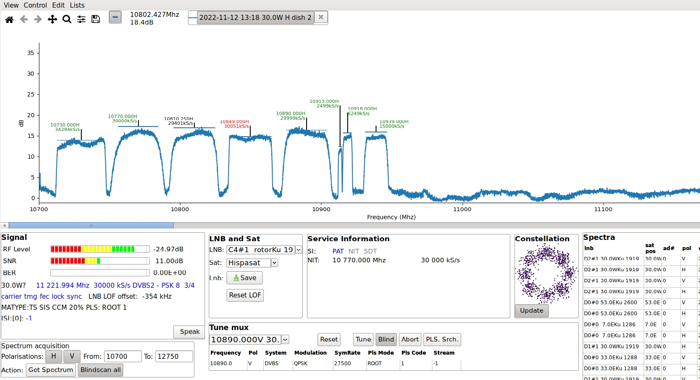

# neumoDVB #

## Spectrum scan ##

Spectra are always scanned using a specific LNB. Make sure tat this LNB is not in use
for any other purpose, switch to the LNB list using `Lists - LNBs`, select one of the LNBs
and press `Ctrl-U` to show the spectrum scan screen.

Spectrum scan only works if you have installed the Neumo blindscan drivers, and even then only on supported
cards. You start by scanning a spectrum, which will then display a graph on the top part of the screen.
Afterwards you can blind scan some or all of the found spectral speaks. Spectra are automatically
remembered, which allows you to find changes.

The screenshot below shows an example of what you get during scanning 30.0W. This is a very
complex screen, so the text below  explains the various steps involved in spectrum acquisition and
blind scan and provides some details on the related parts of the screen.

Blindscanning proceeds in two steps: first you need to acquire a spectrum. After that you can
scan each spectral peak individually, or you can use `Blindscan all`. In the latter case,
neumoDVB will scan all discovered spectral peaks. neumoDVB implements parallel blindscan on some
cards, like those based on the stid135 chip. In this case all available frontends will be connected
in parallel to the LNB being scanned. In practice this means that up to 8 (tbs6909x) muxes will be
scanned simultaneously. Those muxes all will be in the same satellite band and from the same
polarisation. Parallel scan is activated automatically.

### Starting a spectrum acquisition ###

* At the very bottom left on the screen, first select the polarizations you want to scan. Also select
  the frequency range to scan. The default is to scan all, which will take about 40 seconds on TBS6909x.

* Then press the `spectrum scan` button.

Note that some cards, such as tbs5927 allow tuning outside of the normal frequency ranges. If the driver
supports it, you can therefore also enter a low frequency limit the scan below 10.7Ghz or a high frequency
above 12.75Ghz. However, this only works if the LNB frequency limits have been properly adjusted on the
`lnb list` screen.

Spectrum scan is performed one band/polarization at a time. The result will be displayed as a graph
on the top half of the screen. To prevent a complete mess, the graph - which, for a universal LNB, covers the
range 10.7-12.75 Ghz - is zoomed horizontally by default. Above the graph (top left) some command buttons
are available to zoom and pan in the graph. These are from the `matplotlib` library and some of them may operate
a bit awkwardly. From left to right

* The `home` icon will reset the graph to what it was at the start.

* The two `arrow` buttons allow you to undo and redo zoom/pan operations made using the other buttons.

* The `cross` button: while depressed, allows to pan vertically as well as horizontally by clicking the
  left mouse button and then dragging the cursor. Horizontal panning is (unfortunately) not coupled with
  the horizontal scroll bar below and can produce confusing results. Vertical panning is useful when some
  information is not on the screen. NeumoDVB tries its best to provide a good default layout, but does not
  always succeed.

  By clicking the right mouse button instead of the left one, and then dragging the cursor, you can also adjust
  the vertical and horizontal zoom factor.

  **Important** This pan mode remains in effect until you deselect the cross icon (by clicking on it)

* The `loop` icon provides another way of zooming, by selecting a rectangle. Again: do not forget to
  deactivate it after use.

* The `equalizer` button is of little use and will be removed at some point

* The `floppy` icon allows saving the currently displayed part of the plot as a picture.

To the right of these `matlplotlib` buttons are other buttons:

* The `minus` button turns on or off baseline removal. If you LNB is connected with a long cable, then signal
  drop a lot towards the end of the frequency bands. They are lowest just below 11.7 Ghz and near 12.7GHz.
  Base line removal subtracts this trend and allows a better view on the spectrum

* The other buttons allow  you to turn on/off textual annotations on the displayed graphs, or to remove the
  displayed graphs, by clicking in the `X`.

At the bottom right of the screen, your will see a list under the heading `Show/Hide` spectra. This list
contains the spectra you captured earlier and will of course initially be empty. Pressing `Ctrl-Enter` on any
of the spectra, will add it as an additional graph in the plot, or remove it if it was already there.

So what exactly is in these plots? neumoDVB detects peaks in the spectrum, and estimates their center
frequencies and bandwidths. From the bandwidths, neumoDVB **estimates** the symbol rate of the
corresponding mux. This estimate is very rough and is derived from the width of the spectral peaks and
does not take into account the specific modulation of the mux, which is not known at this stage. In fact,
it is not even known that a discovered peak is actually a real mux.

This information is shown using vertical and horizontal lines. For narrow band transponders,
these annotations could quickly become a confusing and overlapping mess. neumoDVB tries to prevent this
by shifting text up as needed. Sometimes this may lead to to the text being above the visible part of the plot.
Use the panning facilities in this case.

After blindscanning a mux (see below), the frequency and symbolrate of a peak is updated with the information
received from the demodulator and -- when available -- with the values reported in the DVB service information
of the mux. The latter always takes precedence. It is usually more accurate, but sometimes it is also
completely wrong due to an error by the broadcaster. Really large errors are ignored by neumoDVB, but
smaller ones cannot be detected and are not corrected.

The color of the text on a peak reflects the scan status: green if a the mux was successfully locked and
scanned, red if no lock was achieved and black in all other cases. Only the green values are reliable.

### Blind scanning muxes ###

After a spectrum has been acquired, press the `Blindscan All` button at the bottom to start
blindscanning all peaks.  neumoDVB will attempt to tune each of the found spectral peaks one after
the other and try to lock a signal.

The whole process is similar to the manual approach that we describe below, except that neumoDVB
automatically starts scanning the next peak after the current one is finished, In manual mode,
You will need to manually start scanning the next peak.

## Blindscan muxes ##

Scanning in manual mode works as follows.

* First disable `Blindscan All` if it is still in progress, by pressing the button.

* Select any of the peaks in the graph by clicking on the text or on the horizontal or vertical
  lines. The selected peak will turn blue (that is to say: its text will turn blue). It is *not* possible
  to select peaks which were not detected by the drivers, but you can still scan such peaks using text entry
  (see below).

* If, for some reason, the desired mux was not detected during peak scanning press
  `Ctrl-A` to enable `mux drawing`: first make sure that none of the matplotlib zoom/pan/scroll functions are
  active. Now click and drag anywhere on the spectrum plot and adjust the rectangle to cover the bandwidth of
  the desired mux. You can also press the `H`, `V`, `L`, `R` keys to indicate the desired polarisation. Once
  satisfied, press `Enter`. This will copy the selected values to the mux tune panel, where you can then tune
  the mux, possibly after changing some other values. During mux drawing, you can also press the `Escape`
  key to abort mux editing

* Start blindscanning the selected spectral peak by pressing the  `Blind` button which tells neumoDVB
  that it should ask the drivers for a blindscan, i.e., it should take the tuning parameters as a starting
  point only and find the correct values itself. This should really be activated by default but it is not.

* Press 'Tune` to start the blindscan process.

If all goes fine, several pieces of information appear in the bottom part of the screen:

The following panels will show various information:

* At the bottom left, the `Signal Panel` shows SNR and signal levels. The different colours in the graphs
  have the following meaning:

  * the red part indicates values which are really too low for any reception;

  * the yellow region indicates levels that are poor, but should still allow viewing;

  * the green parts indicate signal levels well above what is needed, i.e., with a good rain fade margin.

  Note that RF level is usually not very important for good reception, but SNR is.
  There is also a bit error indicator, which shows the error rate before error correction. This is an indicator
  of signal quality.  A non-zero value indicates poorer quality, but it does not necessarily mean that the
  DVB stream contains many errors.

  Below  the signal level indicators, there are a number of indicator labels indicating the current lock
  status. Blue means that the result is good. Red means that the corresponding status is not yet OK.
  Once `sync` becomes blue, data is streaming properly from the drivers;

  The other info shown is:

    * `LNB LOF offset` shows the different between the current local oscillator frequency of the LNB
      and the correct value. LNBs with inaccurate local oscillators can result in frequency offsets
    as large as 2 Mhz, which makes it very difficult to tune to low symbol rate muxes. neumoDVB detects
    learns to compensate for this offset. So if you experience problems with low symbol rate muxes,
    just tune to many high symbol rate muxes in the same frequency band. Gradually the compensation
    will improve and neumoDVB will also start tuning to the low symbol rate muxes correctly.

    * `MATYPE` shows data about the current DVB-S2 modulation scheme

    * `PLS` shows the Physical Layer Scrambling properties, "ROOT-1" in the example

    * `ISI` shows the number of multistreams on this mux between brackets, followed by the list
      of the stream_ids, or -1 in case the mux is not a multistream

* The `LNB and sat` panel allows selecting  another LNB, so that the next spectrum or blind scan can
  operate on another LNB without having to close the spectrum screen and return to the LNB screen.
  As the LNB can be on a rotor, it may also be necessary to select the desired satellite using the `Sat`
  combobox. The `Save` button then saves some information for the LNB such as the default mux. The
  `Reset LOF` box can be used to reset the LOF offset estimate, which is gradually updated with each
  successful tune.

* The `Service information` panel shows information retrieved from the muxes SI tables, if any exist.

  * PAT, NIT, SDT turn black after having seen that type of SI data in the stream, without having
    necessarily  processed all of it yet, i.e., service and mux scan is not necessarily finished
    when the indicators become black. It becomes blue when all of the table is processed.
    Some muxes do not transmit NIT or SDT.

  * "fin" indicates the overall status of SI scanning. It turns blue when scanning is done. This can
    take a while.

* The `Constellation` panel shows recent constellation samples. The example shows 8 clusters, so
  this is mux uses PSK-* modulation. The ``Update` toggle button enables or disables the constellation
  display.

* The `Tune mux` panel allows you to pick an already known (earlier scanned) mux from a list. This
    is very handy if your drivers do not support blind scan, because it will copy the proper tuning parameters,
    such as symbolrate, PLS codes and such. You can still use blind scan if you want.

  * At the very bottom, you can enter tuning parameters directly. This allows you to also tune frequencies
    not detected during spectrum scan. It is however very unlikely that such frequencies will tune. A more
    practical use case is when tuning to low symbol rate muxes. If blind scan fails, you may wish to retry
    with slightly different frequencies and symbol rates. Blind scan is supposed to correct frequency and
    symbol rate values itself, but the value you enter are used as startup hints.

    If blind scan is off, you need to check the tuning parameters carefully, because some may be at wrong values
    due to earlier editing. Wrong values for some parameters, such as `stream_id` or `PLS code` may even
    prevent "blind" tuning;

  * The `reset` button sets the tuning parameters to those found in the selected mux which appear
    below `Tune mux`;

  * The `Tune` button starts tuning;

  * The `ABort` button stops tuning;

  * The `Pls Srch` starts a search procedure to look for an unknown PLS code. This procedure is very time
    consuming: it can take up to an hour. It is also error prone and may not find the correct value.
    neumoDVB has a built-in list of known PLS-code, so on any muxes, the correct PLS codes will be found
    even without this feature. Also some cards, those based on m88rs6060, can discover PLS codes simply by
    tuning. neumoDVB automatically discovers the PLS data in this case.
