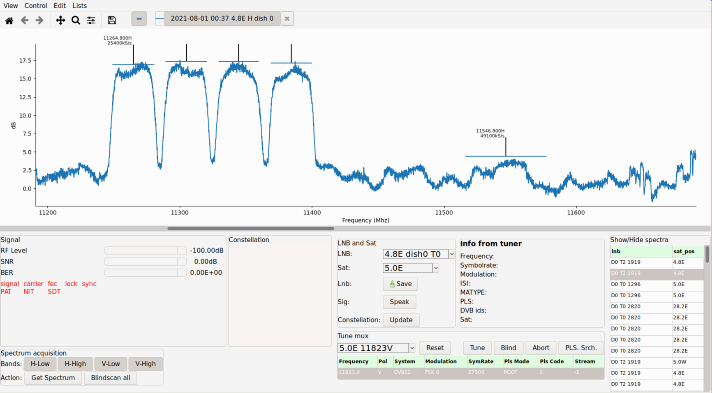
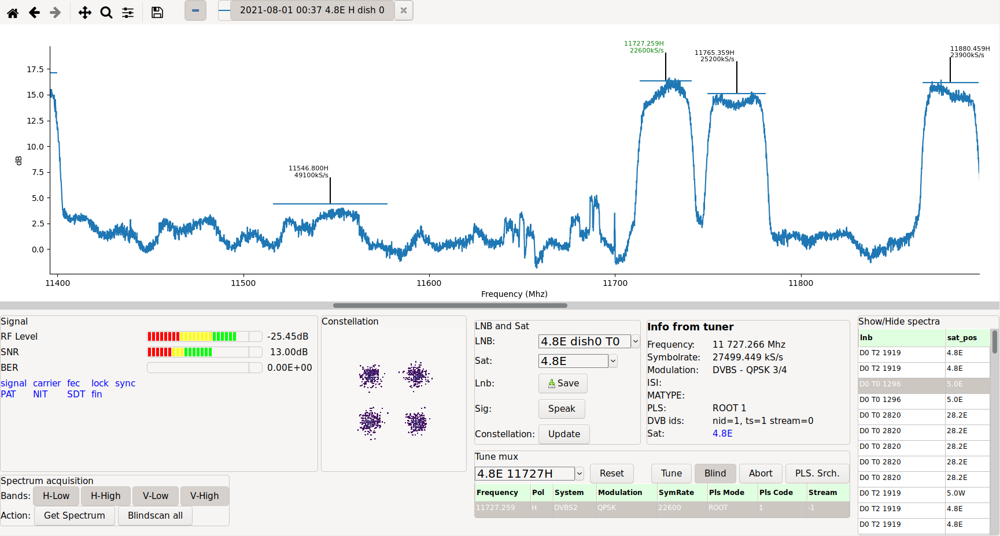
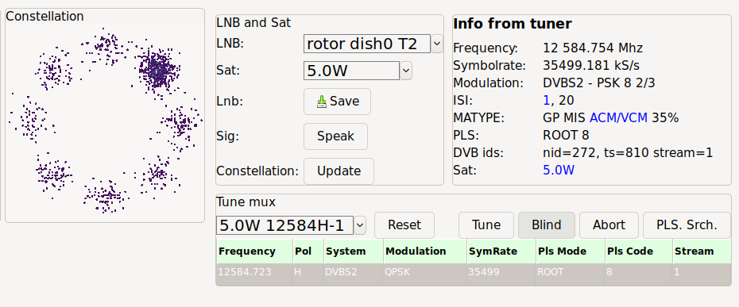

# neumoDVB #

## Spectrum scan ##

Spectra are always scanned using a specific LNB. Make sure tat this LNB is not in use
for any other purpose, switch to the LNB list using `Lists - LNBs`, select one of the LNBs
and press `Ctrl-E` to show the spectrum scan screen.

Spectrum scan only works if you have installed the Neumo blindscan drivers, and even then only on supported
cards. You start by scanning a spectrum, which will then display a graph on the top part of the screen.
Afterwards you can blind scan some or all of the found spectral speaks. Spectra are automatically
remembered, which allows you to find changes.

The screenshot below shows an example of what you get after scanning 4.8 East. This is a very
complex screen, so the text below  explains the various steps involved in spectrum acquisition and
blind scan and provides some details on the related parts of the screen

### Starting a spectrum scan ###
Proceed as follows

* At the very bottom left on the screen, first select the bands and polarizations you want to scan.
 The default is to scan all, which will take about a minute
* Then press the `spectrum scan` button.

Spectrum scan is performed one band/polarization at a time. The result will be displayed as a graph
on the top half of the screen. To prevent a complete mess, the graph - which, for a universal LNB, covers the
range 10.7-12.75 Ghz - is zoomed horizontally by default. Above the graph (top left) some command buttons
are available to zoom and pan in the graph. These are from the `matplotlib` library and some of them may operate
a bit awkwardly. From left to right

* The `home` icon will reset the graph to what it was at the start.
* The two `arrow` buttons allow you to undo and redo zoom/pan operations made using the other buttons.
* The `cross` button: while depressed, allows to pan vertically as well as horizontallyby clicking the left mouse
  button and then dragging the cursor. Horizontal
  panning is (unfortunately) not coupled with the horizontal scroll bar below and can produce confusing results.
  Vertical panning is useful when some information is not on the screen. Neumo tries its best to provide a
  good default layout, but does not always succeed.

  By clicking the right mouse button instead of the left one, and then dragging the cursor, you can also adjust
  the vertical and horizontal zoom factor.

  **Important** This pan mode remains in effect until you deselect the cross icon (by clicking on it)

* The `loop` icon provides another way of zooming, by selecting a rectangle. Again: do not forget to deactivate it
  after use.
* The `equalizer` button is of little use and will be removed at some point
* The `floppy` icon allows saving the currently displayed part of the plot as a picture.

To the right of these `matlplotlib` buttons are other buttons:

* The `minus` button turns on or off baseline removal. If you LNB is connected with a long cable, then signal
  drop a lot towards the end of the frequency bands. They are lowest just below 11.7 Ghz and near 12.7GHz.
  Base line removal subtracts this trend and allows a better view on the spectrum
* The other buttons allow  you to turn on/off textual annotations on the displayed graphs, or to remove the
  displayed graphs, by clicking in the `X`.

At the bottom right of the screen, your will see a list under the heading `Show/Hide` spectra. This list
contains the spectra you captured earlier and will of course initially be empty. Pressing `Ctrl-Enter` on any
of the spectra, will add it as an additional graph in the plot, or remove it if it was already there.

So what exactly is in these plots? Internally in the drivers, an algorithm detects peaks in the spectrum,
and estimates their center frequencies and bandwidths. From the bandwidths, neumoDVB estimates the symbol rate
of the corresponding mux. This information is shown using vertical and horizontal lines. For narrow band transponders,
these annotations could quickly become a confusing and overlapping mess. neumoDVB tries to prevent this
by shifting text up as needed. Sometimes this may lead to to the text being above the visible part of the plot.
Use the panning facilities in this case.

### Blind scanning muxes ###

After a spectrum has been acquired, press the `Blindscan All` button at the bottom to start a "spectrum blindscan".
neumoDVB will attempt to tune each of the found spectral peaks one after the other and try to lock a signal.

The whole process is similar to the manual approach that we describe below, except that neumoDVB automatically
starts scanning the next peak after the current one is finished, In manual mode, You will need to manually
start scanning the next peak.

Scanning in manual mode works as follows:

* First select any of the peaks in the graph by clicking on the text or on the horizontal or vertical
  lines. The selected peak will turn blue (that is to say: its text will turn blue). It is *not* possible
  to select peaks which were not detected by the drivers, but you can still scan such peaks using text entry
  (see below).

* Enable blindscan by depressing the  `Blind` button which tells neumo
  that it should ask the drivers for a blindscan, i.e., it should take the tuning parameters as a starting
  point only and find the correct values itself. This should really be activated by default but it is not.

* Press 'Tune` to start the blindscan process.

If all goes fine, several pieces of information appear in the bottom part of the screen:

The following panels will "light up", so as to speak:

* At the bottom left, the SNR and signal levels will start growing. The different colours in the graphs
  have the following meaning:

  * the red part indicates values which are really too low for any reception;
  * the yellow region indicates levels that are poor, but should still allow viewing;
  * the green parts indicate signal levels well above what is needed, i.e., with a good rain fade margin.

  Note that RF level is usually not very important for good reception, but SNR is.
  There is also a bit error indicator, which shows the error rate before error correction. This is an indicator
  of signal quality.  A non-zero value indicates poorer quality, but it does not necessarily mean that the
  DVB stream contains many errors.

  Below  the signal level indicators, there are a number of indicator labels. Blue means that the result is
  good. Red means that the corresponding status is not yet OK.

  * The first row relates to locking state. Once `sync` is blue, data is streaming properly from the drivers;
  * PAT, NIT, SDT refer to having seen that type of SI data in the stream, without having necessarily processed
    all of it yet, i.e., service and mux scan is not necessarily finished when the indicators become blue.
    Some muxes do not transmit NIT or SDT.
  * "fin" indicates the overall status of SI scanning. It turns blue when scanning is done. This can take a while.

* The second panel from the left at the bottom, shows recent constellation samples. The example shows 4 clouds, so
  this is mux uses QPSK modulation. The clouds do not overlap very much because the SNR is very good.

* The third panel at the bottom allows precise tuning control. On this panel it is possible to select
  another LNB, so that the next spectrum or blind scan can operate on another LNB without having to close the
  spectrum screen and return to the LNB screen.

  As the same LNB can receive multiple satellites, you can also specify the satellite. Except for bugs, neumoDVB
  will attempt to ensure that the entered data is not contradictory.

  * The `save` button on this panel sets the currently tuned mux as the default one for the corresponding network
  (satellite)

  * `Speak`, when enabled will read out the SNR level using computer audio. Every few seconds it will also speak
    the currently tuned satellite position. This information is obtained from the DVB stream, so - apart from bad
    information in the stream - the satellite position is correct. This is handy when tuning a dish: for instance
    you can use a USB card and a laptop to run neumoDVB near your dish. It well tell you if the dish is pointing
    at the right sat, and tell you if adjustments improve the signal. Alternative solutions would include
    sending the audio through other means, e.g., a baby-phone.

  * `Update` enables or disables the constellation display. This is rarely needed, but one use case is the following:
    In Linux, it is possible to run graphical programs on a remote computer. So you can run neumoDVB on the server
    containing your DVB card, but display its output on another computer, e.g., a laptop. By properly configuring
    pulse audio, audio will also be played on the laptop. Again, a handy feature for dish alignment.

    Unfortunately, if your WiFi reception is poor, the program will become sluggish, audio will stutter. It
    turns out that updating the constellation plot causes quite a few bits to flow over the network (for screen
    updates). Turning off the constellation plot, greatly reduces the problem, as only audio needs to flow
    over the network.
  * The `Tune mux` selector allows you to pick an already known (earlier scanned) mux from a list. This
   is very handy if your drivers do not support blind scan, because it will copy the proper tuning parameters,
   such as SymbolRate, PLS codes and such. You can still use blind scan if you want.
  * At the very bottom, you can enter tuning parameters directly. This allows you to also tune frequencies
    not detected during spectrum scan. It is however very unlikely that such frequencies will tune. A more
    practical use case is when tuning to low SymbolRate muxes. If blind scan fails, you may wish to retry
    with slightly different frequencies and symbol rates. Blind scan is supposed to correct frequency and SymbolRate
    errors itself, but the value you enter are used as startup hints.

    If blind scan is off, you need to check the tuning parameters carefully, because some may be at wrong values
    due to earlier editing. Wrong values for some parameters, such as `stream_id` or `PLS code` may even
    prevent "blind" tuning.
  * The `reset` button sets the tuning parameters to those found in the selected mux which appear below `Tune mux`;
  * The `Tune` button starts tuning;
  * The `ABort` button stops tuning.
  * The `Pls Srch` starts a search procedure to look for an unknown PLS code. This procedure is very time consuming:
    it can take up to an hour. It is also error prone and may not find the correct value. neumoDVB has a built-in
    list of known PLS-code, so on any muxes, the correct PLS codes will be found even without this feature.

  * `Info from tuner` shows the actual tuning parameters as reported by the drivers. These may differ from
    what you have entered. For instance, LNBs with inaccurate local oscillators can result in frequency offsets
    as large as 2 Mhz, which makes it very difficult to tune to low symbol rate muxes. By the way: neumoDVB detects
    this problem and learns to compensate for it. So if you experience problems with low SymbolRate muxes,
    just tune to many high symbol rate muxes in the same frequency band. Gradually the compensation will improve
    and neumoDVB will also start tuning to the low SymbolRate muxes correctly.

    * `ISI` lists the detected stream ids for multi-streams. The example is not a multi-stream, which is why
    this field is empty. The example below sows a multi-stream on 5.0W. 2 streams have been detected: 1 and 20.

    * `MATYPE` shows that this is a multi-stream ("MIS")

    * `PLS` shows that this mux uses Physical Layer Scrambling with code "ROOT-8", which uses variable modulation

    * `DVB-ids` shows the stream which neumoDVB is currently decoding; in the case of multi-streams one of the
      streams is selected in the drivers (the one specified in the tuning parameters, or a randomly picked on
      if that info is not available). "nid" and "ts" show the network and transport stream id of that particular
      mux (in multi-streams, each stream is like a separate mux).

    `Sat` shows that the mux is on 5.0W. The color blue indicates that neumoDVB is reasonably sure that the LNB
     is indeed receiving 5.0W. In most cases this is confirmed by the SI info in the stream, but this particular
     mux does not provide correct SI information. In such cases, neumoDVB checks the services on the stream.
     If they correspond well enough with the info stored in the database, it concludes that all is fine. Otherwise,
     you - the user - needs to correct the database...

