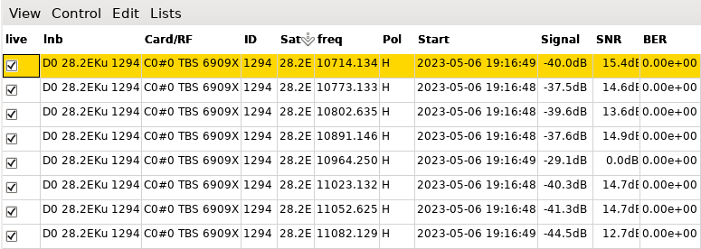

# neumoDVB #

## Status list screen ##

The status list screen displays information about the currently tuned muxes and frontends in use. Some
of this data is also remembered in the `statdb` database, e.g., to remember signal levels and SNR,
which can then be displayed on the signal history plot.

The displayed fields are

* `live`: Indicates if the record is current is current, or from a previous tune. This value will always
  be checked.
* `lnb`: The LNB currently used by the frontend.
* `CARD/RF`: The tuner and frontend used for this tuned mux.
* `Sat`: The satellite used for this tuned mux.
* `Freq`: The tuned frequency.
* `Pol`: The polarisation of the tuned mux.
* `Start`: The time at which the current mux was tuned.
* `Signal`: The current RF level.
* `SNR`: The current SNR.
* `BER`: The current Bit Error Rate.
