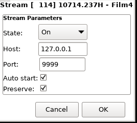
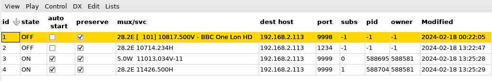

# neumoDVB #

## Streaming services and muxes ##

neumoDVB can stream services and muxes via UDP, either to the computer on which neumoDVB is running (use
`127.0.0.1` as the IP address) or another computer. Streaming can be in unicast (to a specific computer;
use its IP address as destination) or in multicast (to multiple computers; use a multicast address such as 239.255.0.1).
Note that multicast stream tends to work poorly over WIFI.

When creating multiple streams, not that only one stream can be started per port. It is fine to define multiple
streams on the same port, but then only one can be active at the same time. neumoDVB does not **not** check for
incorrect usage! Also, some ports are in use by the operating system or by other programs. So you must select
a free port. A good choice is 9999.

Even unicast may have problems over wifi. If you experience packet loss, then it can help to increase network
buffer size on the destination computer:
```
sudo sysctl -w net.core.rmem_max=26214400
sudo sysctl -w net.core.rmem_default=26214400
```
and also add those variables to  /etc/sysctl.conf

Streams can be viewed using commands like `vlc udp://@:9999` for unicast and `vlc udp://239.255.0.1:9999` for multicast.
You can also use mpv:  `mpv udp://@:9999`


### Creating streams ###
On the `services` or `DVBS muxes`, `DVBC muxes`, or `DVBT muxes`, select a service or mux and select `Command - Add stream`.
The following poup window will appear:



The fields have the following meaning:
* `State` When `On`, the stream will be started immediately and stopped when neumoDVB is stopped or you explicitly
  stop it. Otherwise, a stream will be defined but not yet started
* `Host` The destination hoist to send the stream to. This can be an IP address (unicast or multicast), or a hostname.
* `Port` The port to stream to
* `Auto start` When this option is on, the stream will be automatically restarted when neumoDVB restarts
* `Preserve` When this option is off, the stream entry will be deleted when the stream is stopped

When pressing `OK` the stream entry will be saved and by default the stream will be started.

## The streams list ##

The `streams` list shows all currently defined streams:



After entering edit mode, most fields can be updated. Specifically, by setting `state`
to `ON` or `OFF` a stream can be started or stopped. When parameters such as
`dest host` are changed, the stream will be stopped and restarted to reflect the changes.
The fields mean:

* `id` A unique ID for the stream
* `state` Either `ON` or `OFF`
* `auto start` Whether or not the stream will be started each time neumoDVB is started
* `preserve` Whether or not the stream entry will be deleted in this list when the stream is stopped for some reason
* `mux/svc` The mux or service being streamed.
* `dest host` The IP address the stream is sent to.
* `port` The port the stream is sent to.
* `subs` The internal `subscription_id` if the neumoDVB is streaming the mux; otherwise -1.
* `pid` The process id of the process that actually sends the stream.
* `owner` The process id of the neumoDVB program that sends the stream
* `Modified` Modification time of the stream record.
